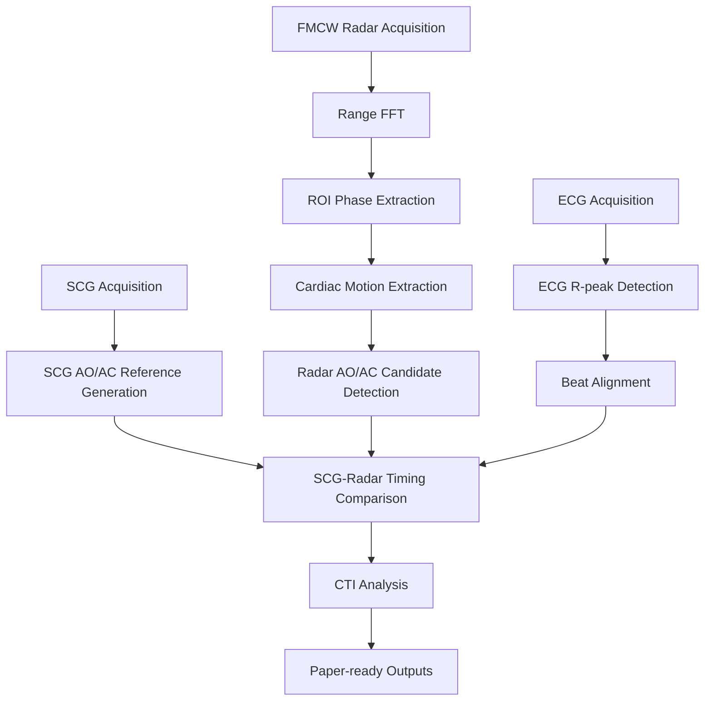

# Analysis of Aortic Valve Opening and Closure Using Cardiac Signals Acquired by Non-Contact FMCW Radar


## Overview

This repository contains research prototype code and firmware documentation for beat-wise analysis of cardiac mechanical event timing from simultaneously acquired ECG, SCG, and FMCW radar signals.

- FMCW radar-based non-contact chest micro-motion analysis
- ECG R-peak based beat alignment
- SCG fiducial point based AO/AC reference timing
- Radar beat morphology based AO/AC candidate detection
- CTI analysis: PEP, LVET, QS2
- Reproducibility support and public release of research code associated with the paper

## Paper

| Item | Description |
|---|---|
| Korean Title | FMCW 레이더 비접촉 측정 기반 심박 신호의 대동맥판 개방 및 폐쇄 시점 분석에 관한 연구 |
| English Title | Analysis of Aortic Valve Opening and Closure Using Cardiac Signals Acquired by Non-Contact FMCW Radar |
| Authors | Hyeong-Rok Ryu, Woo-Seok Kang, Kyung-Ho Kim |
| Affiliation | Dankook University |
| Topic | FMCW Radar, ECG, SCG, AO/AC timing, cardiac mechanical event analysis |

## Repository Structure

```text
.
├── README.md
├── LICENSE
├── NOTICE.md
├── THIRD_PARTY_LICENSES.md
├── requirements.txt
├── .gitignore
├── src/
│   └── ecg_scg_radar_aoac_analysis.py
├── firmware/
│   ├── README.md
│   ├── esp32_mpu6050_scg/
│   │   ├── esp32_mpu6050_scg_100hz.ino
│   │   └── README.md
│   └── stm32_ecg/
│       ├── README.md
│       └── ECG_project/
│           ├── ECG.ioc
│           ├── Core/
│           ├── Drivers/
│           └── STM32CubeIDE project files
├── docs/
│   ├── index.md
│   └── figures/
├── examples/
│   ├── config_example.yaml
│   └── serial_output_examples.md
├── paper/
│   └── README.md
└── results/
    └── .gitkeep
```

## System Architecture



## Hardware Components

| Component | Role | Output |
|---|---|---|
| STM32 ECG module | ECG ADC acquisition | sample_index, ADCValue, Smooth_ECG |
| ESP32 + MPU6050 | SCG acquisition | sample_index, t_ms, ax_g, ay_g, az_g, gx_dps, gy_dps, gz_dps |
| Infineon BGT60TR13C FMCW Radar | Non-contact chest micro-motion acquisition | radar frame / phase displacement |
| PC | Data acquisition and analysis | CSV, JSON, figures |

## Firmware

### STM32 ECG Firmware

- STM32CubeIDE project
- ADC1_IN0 PA0 input
- USART2 serial output
- TIM1 interrupt based 100 Hz sampling
- Output CSV format:

```text
sample_index,ADCValue,Smooth_ECG
```

- Moving average smoothing window = 5
- Baudrate = 115200
- User must confirm ADC pin, timer clock, UART port, and board configuration before flashing.

### ESP32 MPU6050 SCG Firmware

- Arduino sketch
- MPU6050 over I2C
- SDA GPIO21, SCL GPIO22
- 100 Hz sampling
- Output CSV format:

```text
sample_index,t_ms,ax_g,ay_g,az_g,gx_dps,gy_dps,gz_dps
```

- Initial bias calibration included
- User must close Arduino Serial Monitor before running the Python acquisition script.

## Software Requirements

- Python 3.10 or higher recommended
- numpy
- pandas
- scipy
- matplotlib
- pyserial
- scikit-learn
- ifxradarsdk

## Installation

Windows:

```powershell
git clone <repository-url>
cd <repository-name>
python -m venv .venv
.venv\Scripts\activate
pip install -r requirements.txt
```

Linux/macOS:

```bash
git clone <repository-url>
cd <repository-name>
python3 -m venv .venv
source .venv/bin/activate
pip install -r requirements.txt
```

## Configuration

Set local serial ports, output paths, and hardware configuration before acquisition. The default repository configuration uses placeholders so personal PC paths and COM ports are not committed.

| Parameter | Description |
|---|---|
| ECG_PORT | STM32 ECG serial port |
| ECG_BAUD | ECG baud rate |
| SCG_PORT | ESP32/MPU6050 SCG serial port |
| SCG_BAUD | SCG baud rate |
| BASE_DIR | Result output directory |
| RadarConfig | FMCW radar chirp/frame configuration |
| AnalysisConfig | Beat slicing and AO/AC detection parameters |

See `examples/config_example.yaml` for a configuration template. Update the values for the local PC, connected board ports, and radar setup before running acquisition.

## Usage

Current script defaults are edited in the config section near the top of the Python file:

```bash
python src/ecg_scg_radar_aoac_analysis.py
```

If argparse-based configuration loading is added later, this repository includes a ready template:

```bash
python src/ecg_scg_radar_aoac_analysis.py --config examples/config_example.yaml
```

## Serial Output Formats

STM32 ECG:

```csv
sample_index,ADCValue,Smooth_ECG
0,1870,1860
1,1872,1861
```

ESP32 MPU6050 SCG:

```csv
sample_index,t_ms,ax_g,ay_g,az_g,gx_dps,gy_dps,gz_dps
0,0,0.001234,-0.002345,0.003456,0.1234,-0.2345,0.3456
```

Additional examples are in `examples/serial_output_examples.md`.

## Output

The analysis pipeline can generate:

- raw ECG/SCG/Radar acquisition logs
- beat-wise AO/AC timing CSV
- CTI result table
- JSON summary files
- signal quality metrics
- paper-ready figures
- `paper_export` directory

Raw biosignal data may contain sensitive personal information and research data. It is excluded from this repository by default and should not be publicly committed without appropriate consent and anonymization.

## Method Summary

1. ECG acquisition and R-peak detection
2. SCG acquisition and fiducial point extraction
3. FMCW Radar acquisition and phase displacement extraction
4. ECG R-peak based beat segmentation
5. SCG AO/AC reference timing generation
6. Radar AO/AC candidate detection
7. SCG-Radar timing comparison
8. CTI calculation

PEP:

$$
PEP = t_{AO} - t_Q
$$

LVET:

$$
LVET = t_{AC} - t_{AO}
$$

QS2:

$$
QS2 = t_{AC} - t_Q
$$

## Important Notes

- ECG is used as a beat alignment anchor, not as a direct AO/AC ground truth.
- SCG fiducial points are used as reference timing for comparison.
- Radar AO/AC points are morphology-based candidate events, not direct valve imaging results.
- Absolute AO/AC validation requires independent reference modalities such as echocardiography, ICG, or PCG.
- This repository is intended for academic research and reproducibility support.
- This software is not a medical device and must not be used for diagnosis or clinical decision-making.
- Raw biosignal data may contain sensitive personal information and should not be publicly committed without appropriate consent and anonymization.

## Citation

```bibtex
@inproceedings{ryu2026fmcw_aoac,
  title={Analysis of Aortic Valve Opening and Closure Using Cardiac Signals Acquired by Non-Contact FMCW Radar},
  author={Ryu, Hyeong-Rok and Kang, Woo-Seok and Kim, Kyung-Ho},
  year={2026},
  affiliation={Dankook University}
}
```

## Repository Status

- Research prototype
- Single-subject or limited experimental setting if applicable
- Further validation required with independent reference modalities
- Not intended for clinical deployment

## License

MIT License applies to the original analysis code and documentation unless otherwise stated.

STM32 HAL/CMSIS components remain under their original STMicroelectronics license terms. Third-party SDKs such as `ifxradarsdk` follow their own license terms. See `THIRD_PARTY_LICENSES.md` for details.
