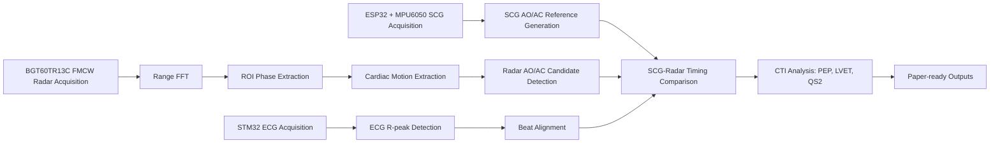

# Analysis of Aortic Valve Opening and Closure Using Cardiac Signals Acquired by Non-Contact FMCW Radar


Beat-wise AO/AC timing analysis using ECG, SCG, and non-contact FMCW radar signals.

> [!IMPORTANT]
> This repository is a research prototype. It is **not** medical diagnosis software and must not be used for clinical decision-making.

---

## Overview

This repository contains the research code and firmware documentation used for beat-wise analysis of aortic valve opening (AO) and aortic valve closure (AC) candidate events from non-contact FMCW radar cardiac signals.

The system acquires ECG, SCG, and FMCW radar signals, aligns beats using ECG R-peaks, generates SCG AO/AC fiducial timing as a reference, and compares radar morphology-based AO/AC candidate timings against the SCG reference.

Core analysis targets:

- FMCW radar-based non-contact cardiac micro-motion analysis
- ECG R-peak-based beat alignment
- SCG fiducial point-based AO/AC reference timing
- Radar beat morphology-based AO/AC candidate detection
- Cardiac Time Interval (CTI) analysis: PEP, LVET, QS2

---

## Paper

| Item | Description |
|---|---|
| Korean Title | FMCW 레이더 비접촉 측정 기반 심박 신호의 대동맥판 개방 및 폐쇄 시점 분석에 관한 연구 |
| English Title | Analysis of Aortic Valve Opening and Closure Using Cardiac Signals Acquired by Non-Contact FMCW Radar |
| Authors | Hyeong-Rok Ryu, Woo-Seok Kang, Kyung-Ho Kim |
| Affiliation | Dankook University |
| Topic | FMCW Radar, ECG, SCG, AO/AC timing, cardiac mechanical event analysis |

The paper reports simultaneous ECG, SCG, and FMCW radar acquisition and beat-wise timing comparison between SCG AO/AC reference points and radar AO/AC morphology-based candidate points.

---

## Repository Structure

```text
.
├── README.md
├── LICENSE
├── NOTICE.md
├── THIRD_PARTY_LICENSES.md
├── requirements.txt
├── .gitignore
├── src/
│   └── ecg_scg_radar_aoac_analysis.py
├── firmware/
│   ├── README.md
│   ├── esp32_mpu6050_scg/
│   │   ├── esp32_mpu6050_scg_100hz.ino
│   │   └── README.md
│   └── stm32_ecg/
│       └── README.md
├── docs/
│   ├── index.md
│   └── figures/
├── examples/
│   ├── config_example.yaml
│   └── serial_output_examples.md
├── paper/
│   └── README.md
└── results/
    └── .gitkeep
```

---

## System Architecture



---

## Hardware Components

| Component | Role | Output |
|---|---|---|
| STM32 ECG module | ECG ADC acquisition | `sample_index, ADCValue, Smooth_ECG` |
| ESP32 + MPU6050 | SCG acquisition | `sample_index, t_ms, ax_g, ay_g, az_g, gx_dps, gy_dps, gz_dps` |
| Infineon BGT60TR13C FMCW Radar | Non-contact chest micro-motion acquisition | Radar frame / phase displacement |
| PC | Data acquisition and analysis | CSV, JSON, figures |

---

## Firmware

### STM32 ECG Firmware

- STM32CubeIDE project
- ADC1_IN0 / PA0 analog input
- USART2 serial output
- PA2 TX, PA3 RX
- TIM1 interrupt-based 100 Hz target sampling
- Baudrate: 115200
- Moving average smoothing window: 5 samples

Serial output:

```csv
sample_index,ADCValue,Smooth_ECG
```

Before flashing, verify ADC pin assignment, timer clock, UART configuration, board target, and analog front-end range.

### ESP32 MPU6050 SCG Firmware

- Arduino sketch
- MPU6050 over I2C
- SDA: GPIO21
- SCL: GPIO22
- 100 Hz target sampling
- Baudrate: 115200
- Startup bias calibration included

Serial output:

```csv
sample_index,t_ms,ax_g,ay_g,az_g,gx_dps,gy_dps,gz_dps
```

Close Arduino Serial Monitor before running the Python acquisition script.

---

## Software Requirements

- Python 3.10 or higher recommended
- numpy
- pandas
- scipy
- matplotlib
- pyserial
- scikit-learn
- ifxradarsdk

---

## Installation

### Windows

```bash
git clone https://github.com/Tontonjeong/fmcw-radar-aoac-cardiac-analysis.git
cd fmcw-radar-aoac-cardiac-analysis
python -m venv .venv
.venv\Scripts\activate
pip install -r requirements.txt
```

### Linux / macOS

```bash
git clone https://github.com/Tontonjeong/fmcw-radar-aoac-cardiac-analysis.git
cd fmcw-radar-aoac-cardiac-analysis
python3 -m venv .venv
source .venv/bin/activate
pip install -r requirements.txt
```

---

## Configuration

The current script uses a configuration section near the top of the Python file. Configure the serial ports and output directory for your own acquisition PC before running.

| Parameter | Description |
|---|---|
| `ECG_PORT` | STM32 ECG serial port |
| `ECG_BAUD` | ECG baud rate |
| `SCG_PORT` | ESP32/MPU6050 SCG serial port |
| `SCG_BAUD` | SCG baud rate |
| `BASE_DIR` | Result output directory |
| `RadarConfig` | FMCW radar chirp/frame configuration |
| `AnalysisConfig` | Beat slicing and AO/AC detection parameters |

Environment variable placeholders are also supported in the public release:

```bash
ECG_PORT=COM4
SCG_PORT=COM29
AOAC_OUTPUT_DIR=./results
```

---

## Usage

```bash
python src/ecg_scg_radar_aoac_analysis.py
```

The script stores outputs under the configured result directory, which defaults to `./results` in the public release.

---

## Serial Output Formats

### STM32 ECG

```csv
sample_index,ADCValue,Smooth_ECG
0,1870,1860
1,1872,1861
```

### ESP32 MPU6050 SCG

```csv
sample_index,t_ms,ax_g,ay_g,az_g,gx_dps,gy_dps,gz_dps
0,0,0.001234,-0.002345,0.003456,0.1234,-0.2345,0.3456
```

---

## Output

Typical analysis outputs include:

- Raw ECG/SCG/Radar acquisition logs
- Beat-wise AO/AC timing CSV
- CTI result table
- JSON summary files
- Signal quality metrics
- Paper-ready figures
- `paper_export` directory

Raw biosignal data may contain sensitive personal information and is intentionally excluded from this repository by default.

---

## Method Summary

1. ECG acquisition and R-peak detection
2. SCG acquisition and fiducial point extraction
3. FMCW radar acquisition and phase displacement extraction
4. ECG R-peak-based beat segmentation
5. SCG AO/AC reference timing generation
6. Radar AO/AC candidate detection
7. SCG-Radar timing comparison
8. CTI calculation

The CTI metrics are defined as:

$$
PEP = t_{AO} - t_Q
$$

$$
LVET = t_{AC} - t_{AO}
$$

$$
QS2 = t_{AC} - t_Q
$$

---

## Important Notes

- ECG is used as a beat alignment anchor, not as a direct AO/AC ground truth.
- SCG fiducial points are used as reference timing for comparison.
- Radar AO/AC points are morphology-based candidate events, not direct valve imaging results.
- Absolute AO/AC validation requires independent reference modalities such as echocardiography, ICG, or PCG.
- This repository is intended for academic research and reproducibility support.
- This software is not a medical device and must not be used for diagnosis or clinical decision-making.
- Raw biosignal data may contain sensitive personal information and should not be publicly committed without appropriate consent and anonymization.

---

## Citation

```bibtex
@inproceedings{ryu2026fmcw_aoac,
  title={Analysis of Aortic Valve Opening and Closure Using Cardiac Signals Acquired by Non-Contact FMCW Radar},
  author={Ryu, Hyeong-Rok and Kang, Woo-Seok and Kim, Kyung-Ho},
  year={2026},
  affiliation={Dankook University}
}
```

---

## Repository Status

- Research prototype
- Limited experimental setting
- Further validation required with independent reference modalities
- Not intended for clinical deployment

---

## License

MIT License applies to the original analysis code and documentation unless otherwise stated. STM32 HAL/CMSIS components remain under their original STMicroelectronics license terms. Third-party SDKs such as `ifxradarsdk` follow their own license terms. See [THIRD_PARTY_LICENSES.md](THIRD_PARTY_LICENSES.md) for details.
