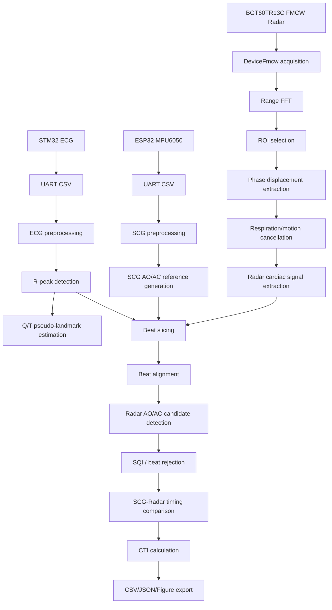

# Analysis of Aortic Valve Opening and Closure Using Cardiac Signals Acquired by Non-Contact FMCW Radar


## Project Summary

This repository contains a research prototype for beat-wise cardiac mechanical event analysis using non-contact FMCW radar, ECG, and SCG signals. The central workflow uses ECG R-peak beat alignment to place ECG, SCG, and radar recordings on a common beat-relative time axis. SCG fiducial reference timing is used for comparison with radar beat morphology, while radar AO/AC candidate timing is extracted from non-contact chest micro-motion. The code computes CTI analysis outputs including PEP, LVET, and QS2, but it does not claim direct valve imaging. Radar AO and AC landmarks are morphology-based candidate timings, not independent ground truth. The repository is intended to make the paper code, embedded firmware, configuration notes, and export workflow understandable and reproducible.

## What This Repository Contains

| Area | Files | Description |
|---|---|---|
| Python analysis | `src/ecg_scg_radar_aoac_analysis.py` | ECG/SCG/Radar acquisition, preprocessing, AO/AC analysis |
| ESP32 SCG firmware | `firmware/esp32_mpu6050_scg/` | MPU6050 6-axis serial acquisition |
| STM32 ECG firmware | `firmware/stm32_ecg/` | ECG ADC sampling and UART streaming |
| Documentation | `docs/` | GitHub Pages project documentation |
| Examples | `examples/` | Configuration and serial output examples |
| Results placeholder | `results/` | Output directory placeholder, raw data excluded |

## Research Context

The study context is simultaneous ECG, SCG, and FMCW Radar acquisition for cardiac timing analysis. ECG R-peak timing is used as the beat alignment anchor because it provides a stable electrical marker. SCG AO/AC fiducial points are used as reference timing for comparison with radar-derived morphology. Radar AO/AC landmarks are candidate events inferred from radar beat morphology, not direct aortic valve opening or closure imaging. Radar AO and Radar AC may show different distribution characteristics because early systolic upstroke-like morphology and late systolic notch/inflection morphology can differ in robustness and timing spread. Independent modalities such as echocardiography, ICG, or PCG are required for absolute valve event validation.

## Documentation Map

| Document | Description |
|---|---|
| [Algorithm Details](docs/algorithm_details.md) | End-to-end processing narrative |
| [Signal Processing Formulas](docs/signal_processing_formulas.md) | Equations used in the pipeline |
| [Detector Methods](docs/detector_methods.md) | AO/AC detector ensemble explanation |
| [Filtering Methods](docs/filtering_methods.md) | Filters and artifact suppression |
| [Radar Processing](docs/radar_processing.md) | FMCW/radar cardiac signal extraction |
| [ECG Processing](docs/ecg_processing.md) | ECG parsing, filtering, R/Q/T landmarks |
| [SCG Processing](docs/scg_processing.md) | SCG parsing and fiducial reference |
| [Beat Alignment and CTI](docs/beat_alignment_and_cti.md) | Beat slicing and timing metrics |
| [SQI and Rejection](docs/sqi_and_rejection.md) | Beat quality metrics |
| [Configuration Reference](docs/configuration_reference.md) | Runtime dataclass defaults |
| [Code Reference](docs/code_reference.md) | Extracted class/function reference |
| [Firmware Guide](docs/firmware_guide.md) | STM32 and ESP32 firmware notes |
| [Output Reference](docs/output_reference.md) | Output files and paper export |
| [References](docs/references.md) | Literature basis |


*Synthetic infographic showing detector candidate overlay and median/confidence-style fusion. It illustrates the candidate-timing concept without using raw biosignal data or copied paper figures.*

## Documentation Links

- GitHub Pages: <https://tontonjeong.github.io/fmcw-radar-aoac-cardiac-analysis/>
- [Algorithm Details](docs/algorithm_details.md)
- [Configuration Reference](docs/configuration_reference.md)
- [Code Reference](docs/code_reference.md)
- [Firmware Guide](docs/firmware_guide.md)
- [Output Reference](docs/output_reference.md)
- [Research Notes](docs/research_notes.md)
- [STM32F411 ECG Firmware Configuration](docs/stm32_f411_ecg_firmware.md)

## System Architecture



## Full Processing Pipeline

1. Hardware acquisition begins with STM32 ECG, ESP32 MPU6050 SCG, and BGT60TR13C radar devices. Each device produces a different stream type, so the Python script coordinates acquisition timing and later aligns signals around ECG R-peaks.
2. Serial data parsing converts STM32 and ESP32 text streams into numeric arrays. ECG time can be reconstructed from `sample_index / ECG_FS_HINT_HZ`, while SCG can use either `t_ms` or `sample_index / SCG_FS_HINT_HZ`.
3. ECG preprocessing normalizes ADC values and suppresses artifacts with Hampel filtering, notch filtering, baseline removal, optional LMS artifact filtering, and optional FFT-domain motion attenuation. The script separates display ECG from QRS-band ECG so figures and R-peak detection can use appropriate representations.
4. R-peak detection uses robust morphology scoring rather than amplitude alone. The detector combines prominence, rising/falling slope, local energy, refractory constraints, and post-processing for implausibly short RR intervals.
5. SCG preprocessing parses MPU6050 acceleration/gyroscope columns and builds an SCG-like waveform. It applies filtering and optional LMS respiration/motion cancellation so mechanical fiducial morphology can be extracted more reliably.
6. SCG reference AO/AC generation uses SCG fiducial extraction logic to create beat-wise timing references. These references support relative comparison with radar candidates, but they are not equivalent to echocardiographic ground truth.
7. Radar frame preprocessing uses Infineon `DeviceFmcw` frames and radar configuration parameters. The code prepares raw frame data for range-domain and phase-based micro-motion analysis.
8. Range FFT and ROI extraction identify a range/angle region associated with chest micro-motion. Functions such as `range_fft`, `dbf_range_angle`, and `beamformed_complex_at` support this extraction.
9. Phase displacement extraction converts selected complex radar returns into a displacement-like cardiac motion trace. This is the radar signal from which morphology-based AO/AC candidates are later detected.
10. Respiration and motion suppression uses adaptive cancellation and cardiac-band filtering. This step is essential because respiration and body motion can dominate non-contact radar displacement.
11. ECG R-peak based beat slicing places ECG, SCG, and radar signals on a beat-relative time axis. Beat windows are controlled by `AnalysisConfig`.
12. Beat alignment and template construction refine beat morphology using template correlation, cross-correlation lag estimation, and limited DTW-style distance checks. Poorly aligned beats can be rejected or down-weighted.
13. Radar AO/AC candidate detection runs several morphology detectors, including slope, notch/tidal, wavelet-like, template, SCG-inspired, and seventh-power AO detector paths. The goal is candidate timing, not direct valve detection.
14. SQI calculation and beat rejection evaluate amplitude stability, cardiac bandpower ratio, template correlation, slope energy, and motion contamination proxy values. Rejected beats protect summary metrics from poor morphology.
15. SCG-Radar AO/AC timing comparison computes relative differences between SCG reference timing and radar candidate timing. These differences are suitable for research analysis but not clinical validation by themselves.
16. CTI calculation reports PEP, LVET, and QS2-style intervals from selected candidate/reference timings. Q/T pseudo-landmarks provide context, not direct AO/AC truth.
17. Paper-ready export writes CSV, JSON, figures, rendered table PNGs, and compact `paper_export` outputs for inspection and manuscript support.

## Code Architecture

| Component | Main Objects / Functions | Role |
|---|---|---|
| Configuration | `ECGConfig`, `SCGConfig`, `RadarConfig`, `AnalysisConfig` | Runtime parameters |
| ECG acquisition | `ECGCollector`, `parse_stm32_ecg_csv_lines` | STM32 ECG collection |
| ECG preprocessing | `preprocess_stm32_ecg`, `robust_ecg_rpeak_detector` | ECG filtering and R-peak detection |
| SCG acquisition | `SCGCollector`, `parse_esp32_mpu6050_scg_csv_lines` | ESP32 MPU6050 SCG collection |
| Radar acquisition | `IfxRadarBackend`, `RadarCollector` | BGT60TR13C frame acquisition |
| Radar preprocessing | `range_fft`, `dbf_range_angle`, `beamformed_complex_at` | Radar signal extraction |
| AO/AC detection | `derivative_detector`, `notch_tidal_detector`, `wavelet_ridge_detector`, `template_detector`, `fuse_candidates` | Candidate event detection |
| SQI | `compute_beat_sqi` | Beat quality assessment |
| Export | `save_all`, `export_paper_tables_and_figures` | CSV/JSON/Figure output |

## Configuration Reference

### ECGConfig

| Parameter | Default / Example | Description | Notes |
|---|---|---|---|
| port | ECG_PORT | Serial port placeholder or local port used by the acquisition device. | str |
| baudrate | ECG_BAUD | UART baudrate used by the serial acquisition stream. | int |
| input_format | ECG_INPUT_FORMAT | Expected CSV schema or stream type for parsing. | str |
| fs_hint_hz | ECG_FS_HINT_HZ | Sampling-rate hint used when timestamps are reconstructed from sample indices. | float |
| timeout_sec | 0.02 | Serial read timeout used by live collection loops. | float |
| band_hz | (5.0, 35.0) | Band-pass range used for analysis filtering. | tuple[float, float] |
| notch_hz | 60.0 | Notch-filter frequency for line-noise suppression. | Optional[float] |
| use_ecg_artifact_lms | True | Enables ECG LMS artifact suppression using a low-frequency reference. | bool |
| ecg_artifact_ref_band_hz | (0.05, 2.0) | Frequency band used to build ECG artifact reference signal. | tuple[float, float] |
| ecg_lms_mu | 0.0012 | LMS adaptation step size for ECG artifact suppression. | float |
| ecg_lms_order | 16 | LMS filter order for ECG artifact suppression. | int |
| ecg_display_band_hz | (0.7, 18.0) | Band used for display-oriented ECG waveform. | tuple[float, float] |
| ecg_qrs_band_hz | (8.0, 25.0) | Band used for QRS/R-peak detection. | tuple[float, float] |
| ecg_hampel_window_sec | 0.15 | Hampel filter window for ECG outlier suppression. | float |

### SCGConfig

| Parameter | Default / Example | Description | Notes |
|---|---|---|---|
| enabled | SCG_ENABLED | Enables or disables the optional channel. | bool |
| port | SCG_PORT | Serial port placeholder or local port used by the acquisition device. | str |
| baudrate | SCG_BAUD | UART baudrate used by the serial acquisition stream. | int |
| fs_hint_hz | SCG_FS_HINT_HZ | Sampling-rate hint used when timestamps are reconstructed from sample indices. | float |
| timeout_sec | 0.02 | Serial read timeout used by live collection loops. | float |
| fail_fast_if_no_scg_sec | 6.0 | SCG acquisition, preprocessing, or reference extraction parameter. | float |
| use_sample_index_time | True | Runtime parameter used by the analysis pipeline; see source for exact usage. | bool |
| signal_mode | 'vmag' | Runtime parameter used by the analysis pipeline; see source for exact usage. | str |
| band_hz | (0.8, 25.0) | Band-pass range used for analysis filtering. | tuple[float, float] |
| lowpass_display_hz | 20.0 | Runtime parameter used by the analysis pipeline; see source for exact usage. | float |
| hampel_window_sec | 0.12 | Timing or filter window parameter used by beat slicing, detection, or smoothing. | float |
| hampel_nsigma | 5.0 | Runtime parameter used by the analysis pipeline; see source for exact usage. | float |

### RadarConfig

| Parameter | Default / Example | Description | Notes |
|---|---|---|---|
| num_rx | 3 | Runtime parameter used by the analysis pipeline; see source for exact usage. | int |
| num_chirps | 8 | Runtime parameter used by the analysis pipeline; see source for exact usage. | int |
| num_samples | 64 | Runtime parameter used by the analysis pipeline; see source for exact usage. | int |
| frame_rate_hz | 100.0 | Radar frame rate used for cardiac motion sampling. | float |
| chirp_repetition_time_s | 0.0005 | Runtime parameter used by the analysis pipeline; see source for exact usage. | float |
| start_freq_hz | 58000000000.0 | FMCW chirp start frequency. | float |
| end_freq_hz | 63500000000.0 | FMCW chirp end frequency. | float |
| sample_rate_hz | 1000000.0 | Runtime parameter used by the analysis pipeline; see source for exact usage. | float |
| tx_power_level | 31 | Runtime parameter used by the analysis pipeline; see source for exact usage. | int |
| if_gain_dB | 33 | Runtime parameter used by the analysis pipeline; see source for exact usage. | int |
| lp_cutoff_Hz | 500000 | Runtime parameter used by the analysis pipeline; see source for exact usage. | int |
| hp_cutoff_Hz | 80000 | Runtime parameter used by the analysis pipeline; see source for exact usage. | int |
| range_fft_size | 128 | Runtime parameter used by the analysis pipeline; see source for exact usage. | int |
| angle_bins | 61 | Runtime parameter used by the analysis pipeline; see source for exact usage. | int |

### AnalysisConfig

| Parameter | Default / Example | Description | Notes |
|---|---|---|---|
| radar_interp_fs_hz | 100.0 | Common interpolation rate for radar beat analysis. | float |
| common_compare_fs_hz | 100.0 | Runtime parameter used by the analysis pipeline; see source for exact usage. | float |
| beat_pre_sec | 0.2 | Seconds retained before each ECG R-peak anchor. | float |
| beat_post_sec | 0.6 | Seconds retained after each ECG R-peak anchor. | float |
| ao_search_sec | (0.07, 0.16) | Runtime parameter used by the analysis pipeline; see source for exact usage. | tuple[float, float] |
| ac_search_sec | (0.25, 0.52) | Runtime parameter used by the analysis pipeline; see source for exact usage. | tuple[float, float] |
| expected_ao_sec | 0.12 | Runtime parameter used by the analysis pipeline; see source for exact usage. | float |
| expected_ac_sec | 0.38 | Runtime parameter used by the analysis pipeline; see source for exact usage. | float |
| compare_start_sec | 3.0 | Runtime parameter used by the analysis pipeline; see source for exact usage. | float |
| compare_end_margin_sec | 3.0 | Runtime parameter used by the analysis pipeline; see source for exact usage. | float |
| max_lag_sec | 2.0 | Acceptance or guard parameter used by detection, rejection, or quality logic. | float |
| psd_nperseg | 512 | Runtime parameter used by the analysis pipeline; see source for exact usage. | int |
| coherence_nperseg | 256 | Runtime parameter used by the analysis pipeline; see source for exact usage. | int |
| min_sqi_accept | 0.35 | Minimum beat SQI threshold for accepted beats. | float |
| aoac_accuracy_tolerance_ms | 30.0 | Runtime parameter used by the analysis pipeline; see source for exact usage. | float |
| use_paper_tight_prior_lock | False | Runtime parameter used by the analysis pipeline; see source for exact usage. | bool |

Full configuration tables are available in [Configuration Reference](docs/configuration_reference.md).

## AO/AC Candidate Detection Methods

### Derivative / Slope Detector

| Field | Description |
|---|---|
| Input | Beat-relative radar cardiac waveform |
| Output | Candidate event time and confidence-like score |
| Purpose | Capture rapid upstroke/downstroke transitions |
| Rough principle | Scores derivative extrema inside AO/AC windows |
| Limitation | Sensitive to noise and requires SQI/template context |

### Notch / Tidal Detector

| Field | Description |
|---|---|
| Input | Beat-relative radar morphology |
| Output | Notch-like candidate timing |
| Purpose | Capture AC-like notch or local minimum morphology |
| Rough principle | Searches for local notch/tidal behavior in the configured window |
| Limitation | Weak notches can be ambiguous under respiration or motion |

### Wavelet-Ridge-Like Detector

| Field | Description |
|---|---|
| Input | Radar beat segment |
| Output | Transient candidate timing |
| Purpose | Detect localized time-frequency ridge evidence |
| Rough principle | Uses CWT/morlet-like evidence when available |
| Limitation | Falls back when wavelet support is unavailable and remains candidate-only |

### Template Detector

| Field | Description |
|---|---|
| Input | Beat morphology and ensemble template |
| Output | Template-consistent candidate timing |
| Purpose | Reduce beat-to-beat ambiguity |
| Rough principle | Uses morphology similarity around expected event timing |
| Limitation | Template quality depends on accepted beats |

### SCG-Inspired Detector

| Field | Description |
|---|---|
| Input | Radar beat morphology |
| Output | AO/AC candidate timing |
| Purpose | Adapt SCG fiducial logic to radar PPG-like morphology |
| Rough principle | Scores slope, zero-crossing, curvature, and extrema patterns |
| Limitation | Radar morphology is not identical to SCG morphology |

### Morphology Event Detector

| Field | Description |
|---|---|
| Input | Beat-relative radar cardiac waveform |
| Output | Candidate event timing and score |
| Purpose | Combine multiple morphology features |
| Rough principle | Uses slope, zero-crossing, curvature, extrema, and timing proximity |
| Limitation | Requires SQI and fusion to handle ambiguous beats |

### Zheng Seventh-Power AO Detector

| Field | Description |
|---|---|
| Input | Radar/SCG-like beat waveform |
| Output | AO-enhanced candidate timing |
| Purpose | Emphasize sharp AO-like pulsatile content |
| Rough principle | Applies seventh-power/envelope style enhancement inspired by SCG literature |
| Limitation | It is an enhancement/candidate method, not direct valve validation |

### Median / Confidence Fusion

Multiple detector candidates are combined using median/confidence-style fusion. The fusion step reduces dependence on a single detector and supports rejection when evidence is inconsistent.

### AC Temporal Tracking

AC can appear as a broad notch or inflection instead of a clean peak. Temporal tracking uses previous/neighboring beat consistency to stabilize AC candidate timing while preserving the candidate-only interpretation.

### ECG Prior Option

Some detector paths can use ECG-derived timing context, but ECG remains a beat anchor and quality context signal. It is not AO/AC ground truth.

## Signal Quality Index and Beat Rejection

| SQI Item | Meaning |
|---|---|
| Amplitude stability | Rejects beats with unstable or too-small morphology |
| Cardiac bandpower ratio | Measures whether cardiac-band content is sufficiently present |
| Template correlation | Checks beat similarity to accepted morphology |
| Slope energy | Measures event-like transition strength |
| Respiration/motion contamination proxy | Flags beats dominated by non-cardiac motion |
| `min_sqi_accept` | Acceptance threshold for beat-level inclusion |

Rejected beats are necessary because radar and SCG signals are vulnerable to posture, respiration, contact, and motion artifacts. Keeping rejected beats visible in outputs helps the researcher audit why summary values were accepted or excluded.

## Output Files

| Output Type | Example | Description |
|---|---|---|
| CSV | beat-wise timing table | Beat-level AO/AC results |
| JSON | summary metrics | Configuration and metrics |
| Figures | paper-ready figures | Signal, timing, and diagnostic plots |
| Tables | rendered table PNGs | Paper/report table exports |
| Logs | acquisition logs | Runtime acquisition diagnostics |

## Firmware Details

### STM32 ECG

The STM32F411 firmware samples ECG-like analog output through `ADC1_IN0` on `PA0`, uses `TIM1` interrupt timing for a 100 Hz target, and streams `sample_index,ADCValue,Smooth_ECG` over `USART2` on `PA2/PA3` at 115200 baud. `Smooth_ECG` is produced with a 5-sample moving average. The STM32CubeIDE project is included under `firmware/stm32_ecg/ECG_project/`.

### ESP32 MPU6050 SCG

The ESP32 sketch reads an MPU6050 over I2C using GPIO21 as SDA and GPIO22 as SCL. It targets 100 Hz output, performs startup bias calibration, and streams `sample_index,t_ms,ax_g,ay_g,az_g,gx_dps,gy_dps,gz_dps`. Keep the sensor still during calibration and close Arduino Serial Monitor before Python acquisition.

## Usage Workflow

1. Flash STM32 ECG firmware.
2. Flash ESP32 MPU6050 firmware.
3. Connect BGT60TR13C radar.
4. Check serial ports.
5. Edit Python config.
6. Run Python acquisition.
7. Inspect output directory.
8. Review SQI and rejected beats.
9. Use exported figures/tables for paper.

## Important Limitations

- This repository is not a medical device.
- It is not clinical diagnosis software.
- Radar AO/AC is candidate timing, not direct valve imaging.
- ECG is a beat anchor, not AO/AC ground truth.
- SCG reference is also not equivalent to echocardiography.
- Absolute validation requires echo/ICG/PCG or another independent reference modality.
- Current use should be interpreted as a research prototype and may reflect single-subject or limited experiment conditions.
- Raw biosignal data may contain sensitive personal information and should not be committed without consent and anonymization.

## Citation

```bibtex
@inproceedings{ryu2026fmcw_aoac,
  title={Analysis of Aortic Valve Opening and Closure Using Cardiac Signals Acquired by Non-Contact FMCW Radar},
  author={Ryu, Hyeong-Rok and Kang, Woo-Seok and Kim, Kyung-Ho},
  year={2026},
  affiliation={Dankook University}
}
```
