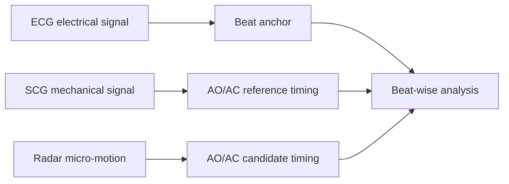
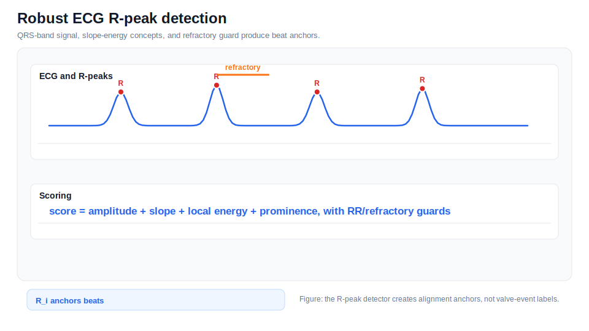
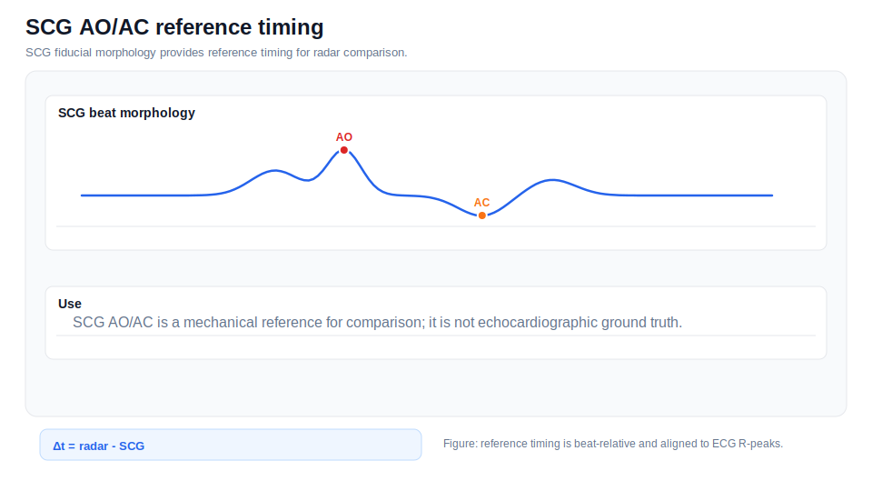
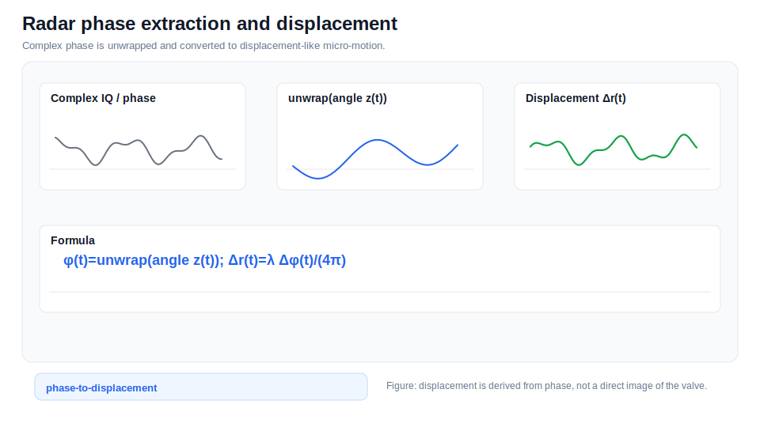
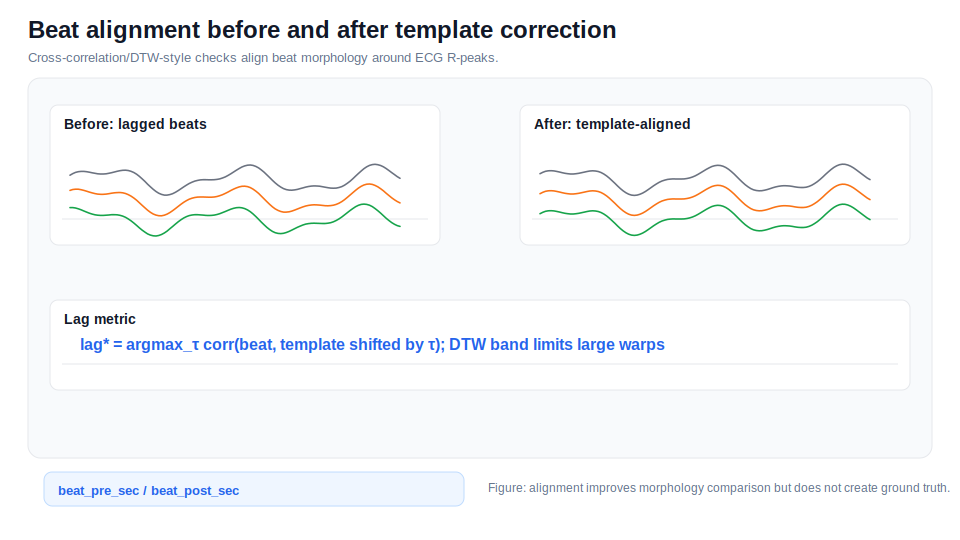
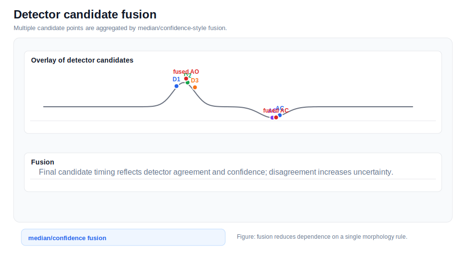
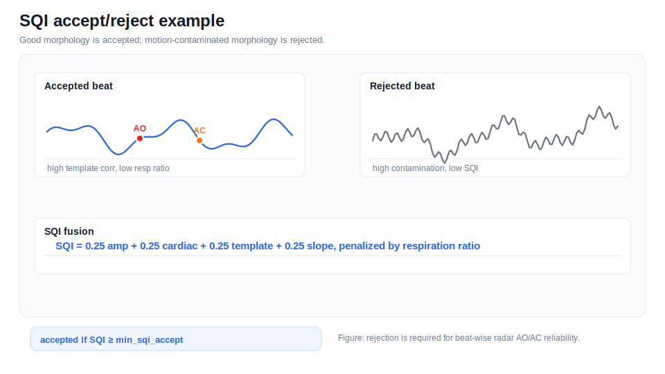
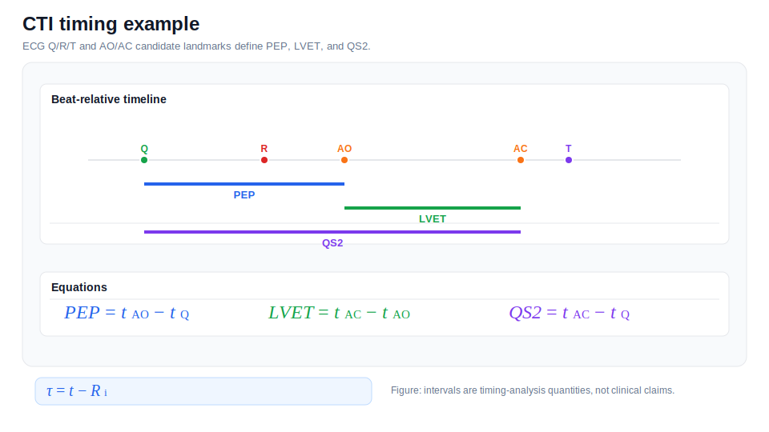

# Algorithm Details

This page provides the end-to-end narrative for the research pipeline. For equations, detector-specific pseudocode, and filter-specific limitations, see the linked detailed pages.

## Documentation Navigation

| Document | Description |
|---|---|
| [Algorithm Details](algorithm_details.md) | End-to-end algorithm narrative |
| [Signal Processing Formulas](signal_processing_formulas.md) | Equations used throughout the pipeline |
| [Detector Methods](detector_methods.md) | AO/AC detector ensemble details |
| [Filtering Methods](filtering_methods.md) | Filters and artifact suppression methods |
| [Radar Processing](radar_processing.md) | FMCW radar processing and micro-motion extraction |
| [ECG Processing](ecg_processing.md) | ECG parsing, preprocessing, R-peaks, and Q/T pseudo-landmarks |
| [SCG Processing](scg_processing.md) | MPU6050 SCG preprocessing and reference fiducials |
| [Beat Alignment and CTI](beat_alignment_and_cti.md) | Beat slicing, alignment, timing metrics, and CTI |
| [SQI and Rejection](sqi_and_rejection.md) | Signal quality metrics and beat rejection |
| [Configuration Reference](configuration_reference.md) | Runtime dataclass defaults |
| [Code Reference](code_reference.md) | Extracted class/function map |
| [Firmware Guide](firmware_guide.md) | STM32 and ESP32 firmware notes |
| [Output Reference](output_reference.md) | Result files and paper export structure |
| [References](references.md) | Literature basis and conceptual adaptation notes |

## 1. Multi-Sensor Acquisition Concept

The system combines STM32 ECG, ESP32 MPU6050 SCG, and BGT60TR13C FMCW radar. The three streams capture electrical timing, contact mechanical vibration, and non-contact chest micro-motion.

## 2. ECG as Beat Anchor

ECG R-peaks are used to segment all signals into beat-relative windows. ECG Q/T pseudo-landmarks are computed for context, but ECG is not treated as AO/AC ground truth.

*ECG R-peak anchor example.*

## 3. SCG as Mechanical Reference

SCG fiducial morphology provides beat-wise AO/AC reference timing for comparison. SCG is closer to mechanical events than ECG, but it is still not an absolute reference modality.

*SCG AO/AC reference example.*

## 4. Radar as Non-Contact Cardiac Motion Signal

Radar frames are transformed into range/phase displacement-like cardiac motion. The radar signal is then filtered and sliced into beats for morphology-based AO/AC candidate detection.

*Radar phase-to-displacement example.*

## 5. Beat-Wise Analysis

Beat windows are sliced around ECG R-peaks, interpolated onto a common sampling rate, and aligned against templates. Cross-correlation and limited DTW-style similarity help evaluate morphology alignment.

*Beat alignment before/after example.*

## 6. Detector Ensemble

The detector ensemble includes slope, notch/tidal, wavelet-like, template, morphology, SCG-inspired, and Zheng-style AO enhancement paths. Fusion combines candidate timings and confidence-like evidence.

*Detector fusion example.*

## 7. SQI and Rejection

SQI evaluates amplitude stability, cardiac bandpower ratio, template correlation, slope energy, and respiration contamination. Beats that fail quality gates are rejected to protect timing summaries.

*SQI accept/reject example.*

## 8. CTI and Timing Comparison

SCG-radar timing differences and CTI quantities such as PEP, LVET, and QS2 are computed from candidate/reference timings. These are research metrics, not clinical endpoints.

*CTI timeline example.*

## 9. Paper Export

The export stage writes CSV tables, JSON summaries, diagnostic figures, compact paper figures, and rendered table PNGs. Raw biosignal data remains excluded from the public repository.
