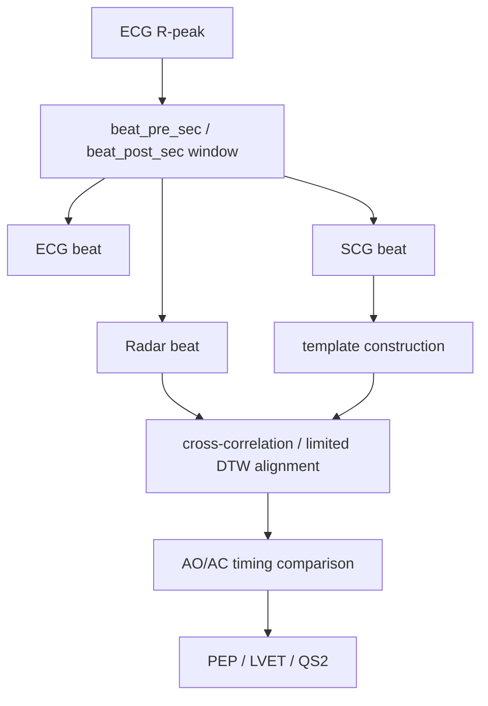

# Beat Alignment and CTI

## Documentation Navigation

| Document | Description |
|---|---|
| [Algorithm Details](algorithm_details.md) | End-to-end algorithm narrative |
| [Signal Processing Formulas](signal_processing_formulas.md) | Equations used throughout the pipeline |
| [Detector Methods](detector_methods.md) | AO/AC detector ensemble details |
| [Filtering Methods](filtering_methods.md) | Filters and artifact suppression methods |
| [Radar Processing](radar_processing.md) | FMCW radar processing and micro-motion extraction |
| [ECG Processing](ecg_processing.md) | ECG parsing, preprocessing, R-peaks, and Q/T pseudo-landmarks |
| [SCG Processing](scg_processing.md) | MPU6050 SCG preprocessing and reference fiducials |
| [Beat Alignment and CTI](beat_alignment_and_cti.md) | Beat slicing, alignment, timing metrics, and CTI |
| [SQI and Rejection](sqi_and_rejection.md) | Signal quality metrics and beat rejection |
| [Configuration Reference](configuration_reference.md) | Runtime dataclass defaults |
| [Code Reference](code_reference.md) | Extracted class/function map |
| [Firmware Guide](firmware_guide.md) | STM32 and ESP32 firmware notes |
| [Output Reference](output_reference.md) | Result files and paper export structure |
| [References](references.md) | Literature basis and conceptual adaptation notes |

*Beat alignment before and after example.*

ECG R-peaks define beat-relative time. SCG and radar beat windows are sliced around the same anchors and then aligned to templates where appropriate.

*CTI timing example.*

## Pseudo Reference Timing

$$AO_i^{ref}=R_i+\operatorname{clip}(\lambda_{AO}QT_i,\tau_{AO,min},\tau_{AO,max})$$

$$AC_i^{ref}=R_i+\operatorname{clip}(\lambda_{AC}QT_i,\tau_{AC,min},\tau_{AC,max})$$

This ECG Q/R/T-based reference is a pseudo timing context, not a ground-truth valve reference.

## SCG-Radar Timing Difference

$$\Delta t_i^{AO}=(AO_i^{radar}-AO_i^{SCG})\times1000$$

$$\Delta t_i^{AC}=(AC_i^{radar}-AC_i^{SCG})\times1000$$

## CTI

$$PEP_i=t_{AO,i}-t_{Q,i}$$

$$LVET_i=t_{AC,i}-t_{AO,i}$$

$$QS2_i=t_{AC,i}-t_{Q,i}$$

## Accuracy-Style Utilities

The code includes within-tolerance and summary utilities for pseudo/reference timing differences. These should be reported as research comparison metrics unless independent validation is available.
