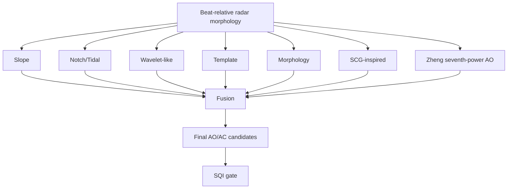
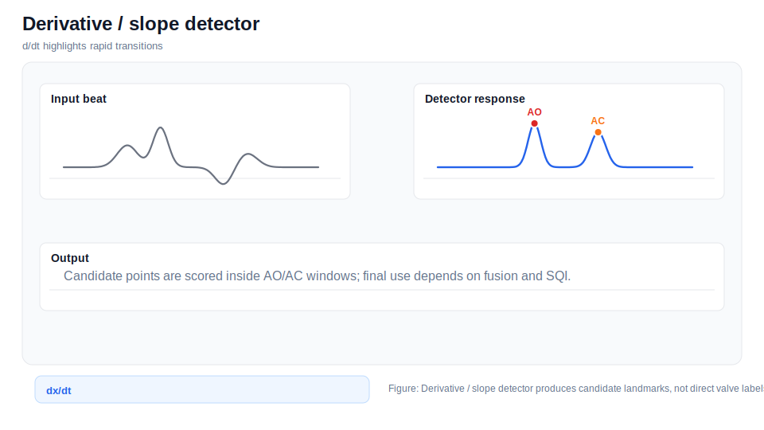
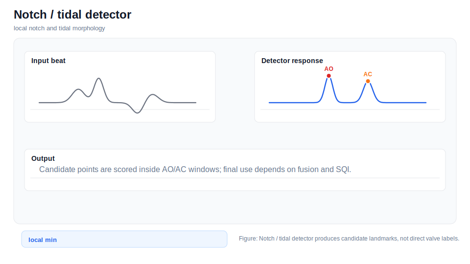
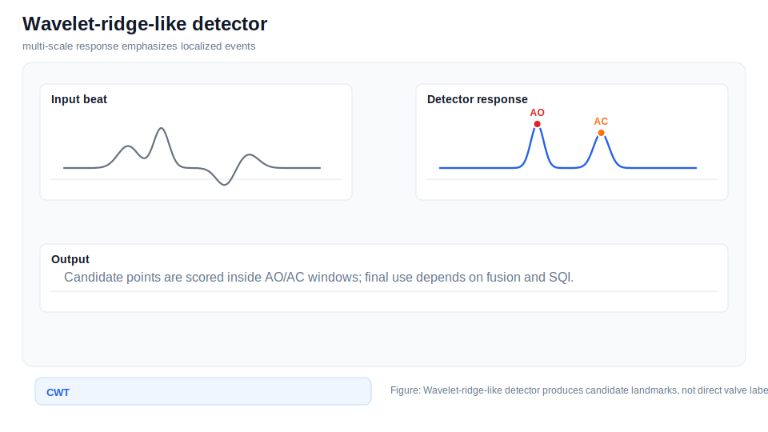
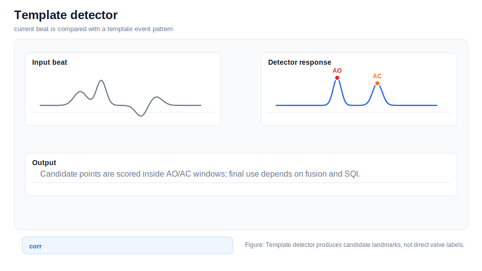
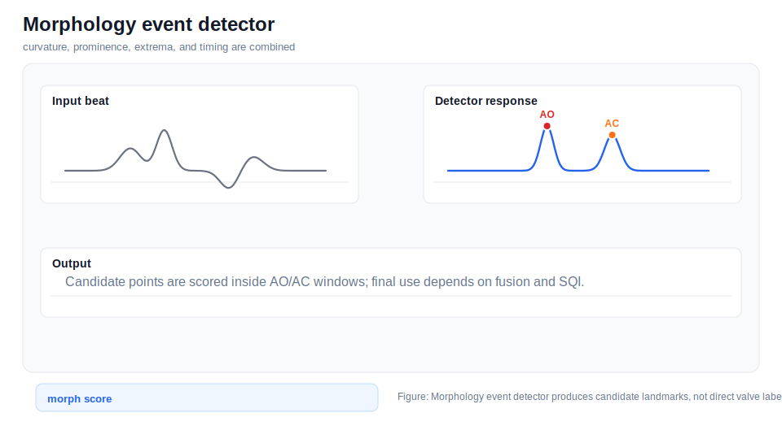
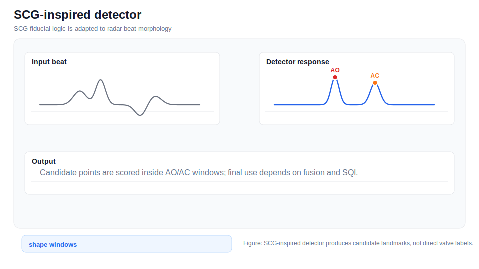
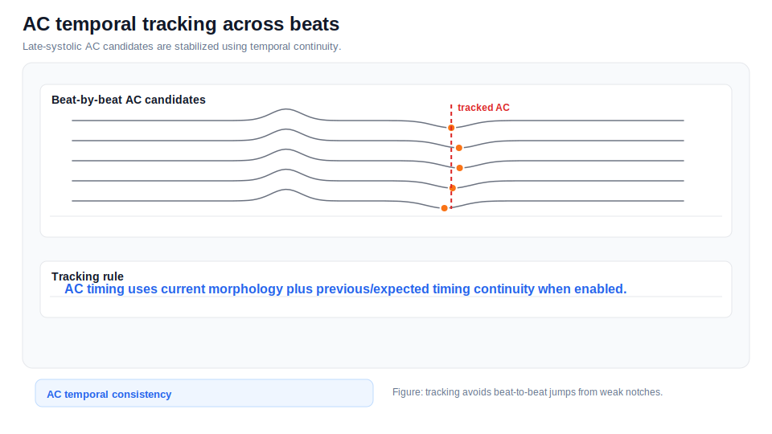

# Detector Methods

AO/AC detectors in this repository produce morphology-based candidate timings. They do not perform direct valve imaging.

## Documentation Navigation

| Document | Description |
|---|---|
| [Algorithm Details](algorithm_details.md) | End-to-end algorithm narrative |
| [Signal Processing Formulas](signal_processing_formulas.md) | Equations used throughout the pipeline |
| [Detector Methods](detector_methods.md) | AO/AC detector ensemble details |
| [Filtering Methods](filtering_methods.md) | Filters and artifact suppression methods |
| [Radar Processing](radar_processing.md) | FMCW radar processing and micro-motion extraction |
| [ECG Processing](ecg_processing.md) | ECG parsing, preprocessing, R-peaks, and Q/T pseudo-landmarks |
| [SCG Processing](scg_processing.md) | MPU6050 SCG preprocessing and reference fiducials |
| [Beat Alignment and CTI](beat_alignment_and_cti.md) | Beat slicing, alignment, timing metrics, and CTI |
| [SQI and Rejection](sqi_and_rejection.md) | Signal quality metrics and beat rejection |
| [Configuration Reference](configuration_reference.md) | Runtime dataclass defaults |
| [Code Reference](code_reference.md) | Extracted class/function map |
| [Firmware Guide](firmware_guide.md) | STM32 and ESP32 firmware notes |
| [Output Reference](output_reference.md) | Result files and paper export structure |
| [References](references.md) | Literature basis and conceptual adaptation notes |



## Derivative / Slope Detector



*Derivative / Slope Detector infographic.*

### Purpose
AO/AC event candidates where derivative extrema are strong.

### Input
Derivative extrema inside AO/AC windows.

### Output
Candidate time and detector score.

### Search Window
AO: early systolic window; AC: late systolic window from `AnalysisConfig`.

### Mathematical Principle
Implementation-level approximation: detector-specific feature scores are computed inside the search window and converted into candidate time/score pairs.

### Pseudocode

```text
for beat in accepted_or_candidate_beats:
    window = select_event_window(beat, AO_or_AC)
    feature = detector_specific_response(beat[window])
    candidate = argmax_or_extremum(feature)
    return candidate_time, score
```

### Diagram
See the infographic above.

### Strengths
This detector contributes an interpretable morphology cue to the ensemble.

### Limitations
Slope can be high in noise or motion artifacts.

### Code Location
``derivative_detector`` in `src/ecg_scg_radar_aoac_analysis.py`.

## Notch / Tidal Detector



*Notch / Tidal Detector infographic.*

### Purpose
AC-like notch or tidal morphology detection.

### Input
Beat morphology in AC-style window.

### Output
Candidate notch/tidal timing.

### Search Window
Primarily AC search region.

### Mathematical Principle
Implementation-level approximation: detector-specific feature scores are computed inside the search window and converted into candidate time/score pairs.

### Pseudocode

```text
for beat in accepted_or_candidate_beats:
    window = select_event_window(beat, AO_or_AC)
    feature = detector_specific_response(beat[window])
    candidate = argmax_or_extremum(feature)
    return candidate_time, score
```

### Diagram
See the infographic above.

### Strengths
This detector contributes an interpretable morphology cue to the ensemble.

### Limitations
Weak notches can be ambiguous.

### Code Location
``notch_tidal_detector`` in `src/ecg_scg_radar_aoac_analysis.py`.

## Wavelet-Ridge-Like Detector



*Wavelet-Ridge-Like Detector infographic.*

### Purpose
Localized transient response detection.

### Input
Beat waveform and search window.

### Output
Candidate timing from multi-scale response.

### Search Window
AO/AC windows.

### Mathematical Principle
Implementation-level approximation: detector-specific feature scores are computed inside the search window and converted into candidate time/score pairs.

### Pseudocode

```text
for beat in accepted_or_candidate_beats:
    window = select_event_window(beat, AO_or_AC)
    feature = detector_specific_response(beat[window])
    candidate = argmax_or_extremum(feature)
    return candidate_time, score
```

### Diagram
See the infographic above.

### Strengths
This detector contributes an interpretable morphology cue to the ensemble.

### Limitations
Fallback behavior if CWT support is unavailable.

### Code Location
``wavelet_ridge_detector`` in `src/ecg_scg_radar_aoac_analysis.py`.

## Template / Ensemble Detector



*Template / Ensemble Detector infographic.*

### Purpose
Template-consistent landmark selection.

### Input
Current beat plus template beat.

### Output
Template-matched candidate timing.

### Search Window
AO/AC windows.

### Mathematical Principle
Implementation-level approximation: detector-specific feature scores are computed inside the search window and converted into candidate time/score pairs.

### Pseudocode

```text
for beat in accepted_or_candidate_beats:
    window = select_event_window(beat, AO_or_AC)
    feature = detector_specific_response(beat[window])
    candidate = argmax_or_extremum(feature)
    return candidate_time, score
```

### Diagram
See the infographic above.

### Strengths
This detector contributes an interpretable morphology cue to the ensemble.

### Limitations
Template can be biased if accepted beats are poor.

### Code Location
``template_detector`` in `src/ecg_scg_radar_aoac_analysis.py`.

## Morphology Event Detector



*Morphology Event Detector infographic.*

### Purpose
General morphology scoring.

### Input
Beat-relative radar cardiac waveform.

### Output
AO/AC candidate and score.

### Search Window
Configured AO/AC search windows.

### Mathematical Principle
Implementation-level approximation: detector-specific feature scores are computed inside the search window and converted into candidate time/score pairs.

### Pseudocode

```text
for beat in accepted_or_candidate_beats:
    window = select_event_window(beat, AO_or_AC)
    feature = detector_specific_response(beat[window])
    candidate = argmax_or_extremum(feature)
    return candidate_time, score
```

### Diagram
See the infographic above.

### Strengths
This detector contributes an interpretable morphology cue to the ensemble.

### Limitations
Requires fusion and SQI to handle ambiguous morphology.

### Code Location
``morphology_event_detector`` in `src/ecg_scg_radar_aoac_analysis.py`.

## SCG-Inspired Detector



*SCG-Inspired Detector infographic.*

### Purpose
Adapt SCG fiducial logic to radar-like beats.

### Input
Radar or SCG-like beat waveform.

### Output
Candidate AO/AC timing.

### Search Window
AO/AC windows.

### Mathematical Principle
Implementation-level approximation: detector-specific feature scores are computed inside the search window and converted into candidate time/score pairs.

### Pseudocode

```text
for beat in accepted_or_candidate_beats:
    window = select_event_window(beat, AO_or_AC)
    feature = detector_specific_response(beat[window])
    candidate = argmax_or_extremum(feature)
    return candidate_time, score
```

### Diagram
See the infographic above.

### Strengths
This detector contributes an interpretable morphology cue to the ensemble.

### Limitations
Radar morphology is not identical to SCG.

### Code Location
``scg_inspired_aoac_detector`` in `src/ecg_scg_radar_aoac_analysis.py`.

## Zheng Seventh-Power AO Detector


*Zheng Seventh-Power AO Detector infographic.*

### Purpose
Enhance sharp AO-like events.

### Input
AO-like reconstructed signal or filtered beat.

### Output
AO candidate timing.

### Search Window
AO window.

### Mathematical Principle
Implementation-level approximation: detector-specific feature scores are computed inside the search window and converted into candidate time/score pairs.

### Pseudocode

```text
for beat in accepted_or_candidate_beats:
    window = select_event_window(beat, AO_or_AC)
    feature = detector_specific_response(beat[window])
    candidate = argmax_or_extremum(feature)
    return candidate_time, score
```

### Diagram
See the infographic above.

### Strengths
This detector contributes an interpretable morphology cue to the ensemble.

### Limitations
Conceptual adaptation; not direct valve validation.

### Code Location
``zheng_seventh_power_ao_detector`` in `src/ecg_scg_radar_aoac_analysis.py`.

## Confidence Fusion


*Confidence Fusion infographic.*

### Purpose
Aggregate detector candidates.

### Input
List of detector candidate dictionaries.

### Output
Fused candidate time and confidence.

### Search Window
After detector-specific windows.

### Mathematical Principle
Implementation-level approximation: detector-specific feature scores are computed inside the search window and converted into candidate time/score pairs.

### Pseudocode

```text
for beat in accepted_or_candidate_beats:
    window = select_event_window(beat, AO_or_AC)
    feature = detector_specific_response(beat[window])
    candidate = argmax_or_extremum(feature)
    return candidate_time, score
```

### Diagram
See the infographic above.

### Strengths
This detector contributes an interpretable morphology cue to the ensemble.

### Limitations
Disagreement should be interpreted as uncertainty.

### Code Location
``fuse_candidates`` in `src/ecg_scg_radar_aoac_analysis.py`.

## AC Temporal Tracking



*AC Temporal Tracking infographic.*

### Purpose
Stabilize AC across beats.

### Input
Current AC candidates plus temporal context.

### Output
Tracked AC timing.

### Search Window
AC temporal tracking window.

### Mathematical Principle
Implementation-level approximation: detector-specific feature scores are computed inside the search window and converted into candidate time/score pairs.

### Pseudocode

```text
for beat in accepted_or_candidate_beats:
    window = select_event_window(beat, AO_or_AC)
    feature = detector_specific_response(beat[window])
    candidate = argmax_or_extremum(feature)
    return candidate_time, score
```

### Diagram
See the infographic above.

### Strengths
This detector contributes an interpretable morphology cue to the ensemble.

### Limitations
Can smooth over beat-specific morphology if overtrusted.

### Code Location
``ac_temporal_tracking_refine`` in `src/ecg_scg_radar_aoac_analysis.py`.
