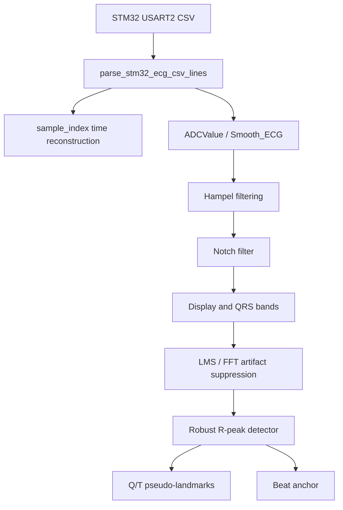
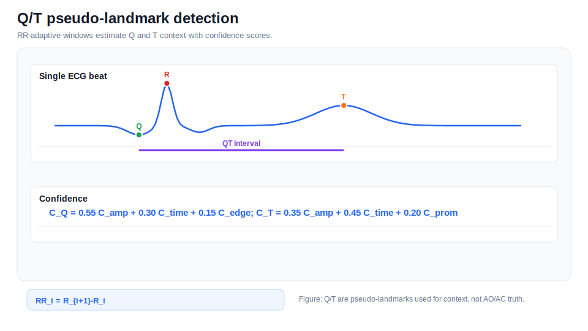

# ECG Processing

## Documentation Navigation

| Document | Description |
|---|---|
| [Algorithm Details](algorithm_details.md) | End-to-end algorithm narrative |
| [Signal Processing Formulas](signal_processing_formulas.md) | Equations used throughout the pipeline |
| [Detector Methods](detector_methods.md) | AO/AC detector ensemble details |
| [Filtering Methods](filtering_methods.md) | Filters and artifact suppression methods |
| [Radar Processing](radar_processing.md) | FMCW radar processing and micro-motion extraction |
| [ECG Processing](ecg_processing.md) | ECG parsing, preprocessing, R-peaks, and Q/T pseudo-landmarks |
| [SCG Processing](scg_processing.md) | MPU6050 SCG preprocessing and reference fiducials |
| [Beat Alignment and CTI](beat_alignment_and_cti.md) | Beat slicing, alignment, timing metrics, and CTI |
| [SQI and Rejection](sqi_and_rejection.md) | Signal quality metrics and beat rejection |
| [Configuration Reference](configuration_reference.md) | Runtime dataclass defaults |
| [Code Reference](code_reference.md) | Extracted class/function map |
| [Firmware Guide](firmware_guide.md) | STM32 and ESP32 firmware notes |
| [Output Reference](output_reference.md) | Result files and paper export structure |
| [References](references.md) | Literature basis and conceptual adaptation notes |

*ECG raw vs filtered synthetic example.*

The STM32 stream provides raw ADC and smoothed ECG-like values. The public parser supports `sample_index,ADCValue,Smooth_ECG`, and time can be reconstructed as `sample_index / ECG_FS_HINT_HZ`.

*Hampel outlier replacement example.*

Hampel filtering suppresses isolated spikes before QRS detection. The method uses local median and MAD, making it robust to single-sample outliers.

*Notch filtering example.*

The notch filter suppresses powerline-like interference around a configured frequency. It is separate from broadband motion suppression.

*R-peak detection example.*

`robust_ecg_rpeak_detector` combines amplitude, slope, local energy, prominence, zero-crossing context, and refractory constraints. Short-RR postprocessing removes likely duplicate detections without changing the main detector.

*Q/T pseudo-landmark example.*

Q/T pseudo-landmarks use RR-adaptive windows and confidence scores. The code uses `C_Q = 0.55 C_amp + 0.30 C_time + 0.15 C_edge` and `C_T = 0.35 C_amp + 0.45 C_time + 0.20 C_prom`; these are pseudo landmarks, not clinical ECG interval validation.

## Key Equations

$$RR_i = R_{i+1} - R_i$$

$$QT_i = T_i - Q_i$$

$$\tau = t - R_i$$

## Interpretation Limit

ECG R-peaks are used as beat anchors. ECG is not used as direct AO/AC ground truth.
