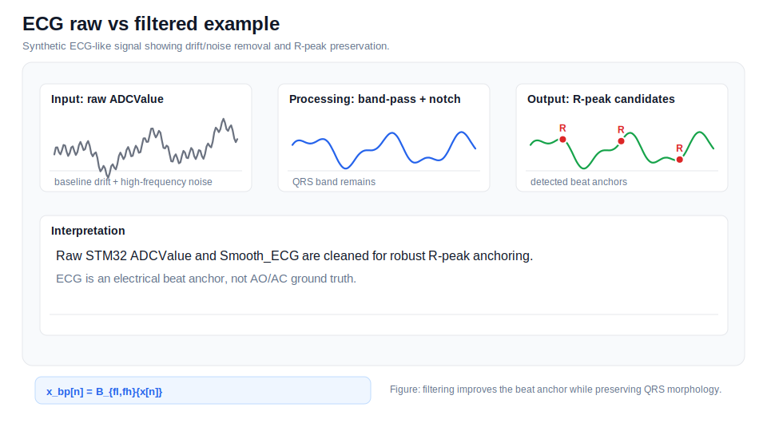
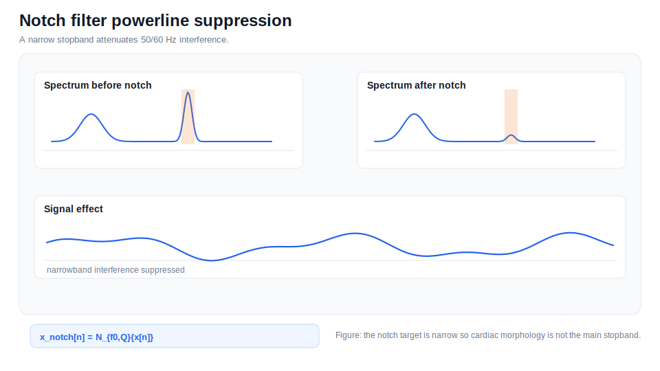
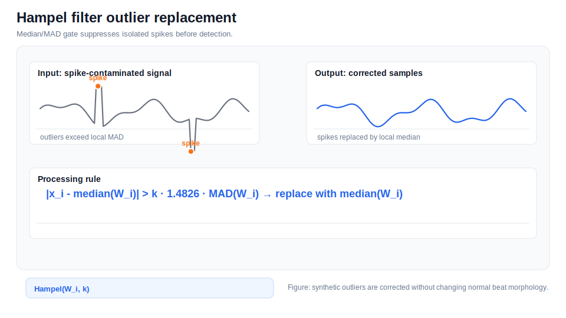
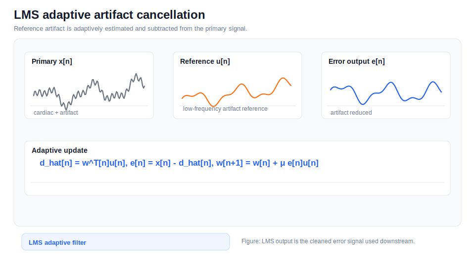
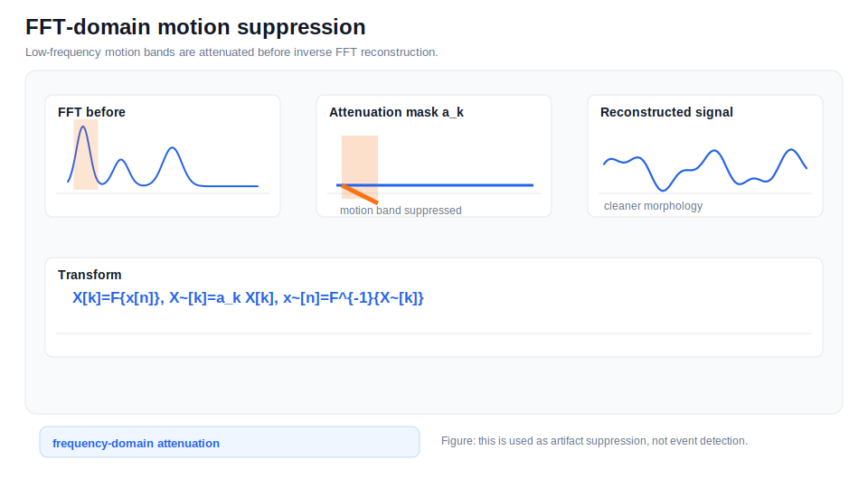
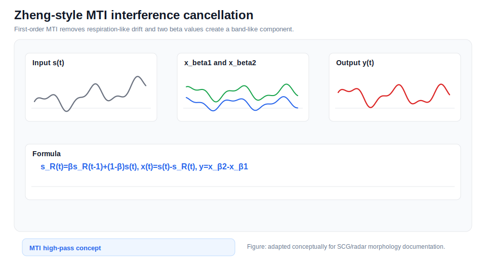
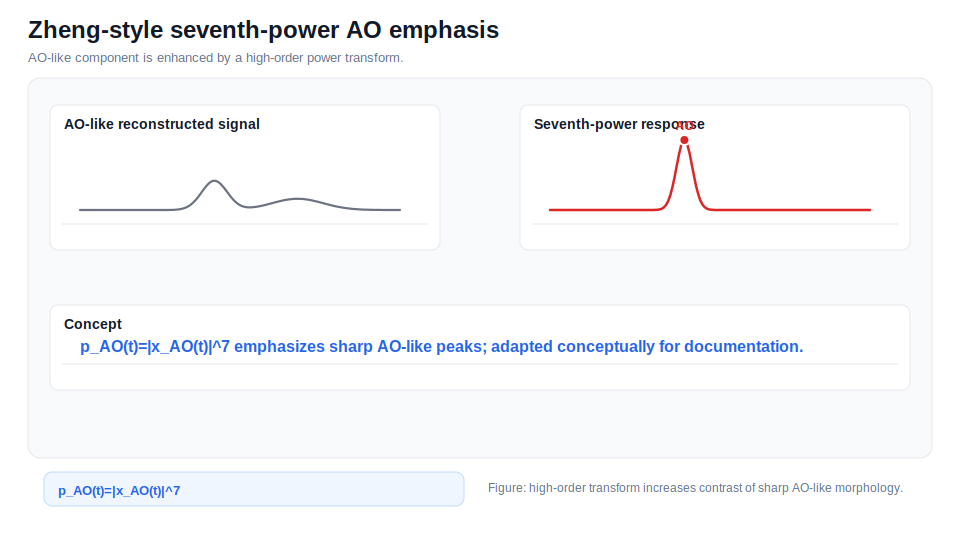

# Filtering Methods

This page documents filters and artifact-suppression methods used or represented in the analysis code.

## Documentation Navigation

| Document | Description |
|---|---|
| [Algorithm Details](algorithm_details.md) | End-to-end algorithm narrative |
| [Signal Processing Formulas](signal_processing_formulas.md) | Equations used throughout the pipeline |
| [Detector Methods](detector_methods.md) | AO/AC detector ensemble details |
| [Filtering Methods](filtering_methods.md) | Filters and artifact suppression methods |
| [Radar Processing](radar_processing.md) | FMCW radar processing and micro-motion extraction |
| [ECG Processing](ecg_processing.md) | ECG parsing, preprocessing, R-peaks, and Q/T pseudo-landmarks |
| [SCG Processing](scg_processing.md) | MPU6050 SCG preprocessing and reference fiducials |
| [Beat Alignment and CTI](beat_alignment_and_cti.md) | Beat slicing, alignment, timing metrics, and CTI |
| [SQI and Rejection](sqi_and_rejection.md) | Signal quality metrics and beat rejection |
| [Configuration Reference](configuration_reference.md) | Runtime dataclass defaults |
| [Code Reference](code_reference.md) | Extracted class/function map |
| [Firmware Guide](firmware_guide.md) | STM32 and ESP32 firmware notes |
| [Output Reference](output_reference.md) | Result files and paper export structure |
| [References](references.md) | Literature basis and conceptual adaptation notes |

## Butterworth Band-Pass

*Butterworth Band-Pass example.*

| Field | Description |
|---|---|
| Purpose | Emphasizes cardiac frequency content. |
| Equation | $$x_{bp}[n]=\mathcal{B}_{f_l,f_h}\{x[n]\}$$ |
| Applied Signal | ECG, SCG, radar cardiac-band extraction |
| Implementation Note | Parameters are controlled by the corresponding configuration dataclass or helper function. |
| Risk / Limitation | Passband choices affect morphology. |

## Low-Pass Display Filtering

*Low-Pass Display Filtering example.*

| Field | Description |
|---|---|
| Purpose | Creates smoother figures and broad-wave inspection signals. |
| Equation | $$x_{lp}[n]=\mathcal{L}_{f_c}\{x[n]\}$$ |
| Applied Signal | Display ECG/SCG traces |
| Implementation Note | Parameters are controlled by the corresponding configuration dataclass or helper function. |
| Risk / Limitation | Display filtering is not validation. |

## Notch Filter

*Notch Filter example.*

| Field | Description |
|---|---|
| Purpose | Suppresses narrowband powerline interference. |
| Equation | $$x_{notch}[n]=\mathcal{N}_{f_0,Q}\{x[n]\}$$ |
| Applied Signal | ECG line-noise suppression |
| Implementation Note | Parameters are controlled by the corresponding configuration dataclass or helper function. |
| Risk / Limitation | Does not remove broadband movement. |

## Hampel Filter

*Hampel Filter example.*

| Field | Description |
|---|---|
| Purpose | Replaces isolated spikes with local median. |
| Equation | $$|x_i-median(W_i)|>k\cdot1.4826\cdot MAD(W_i)$$ |
| Applied Signal | ECG and SCG outlier suppression |
| Implementation Note | Parameters are controlled by the corresponding configuration dataclass or helper function. |
| Risk / Limitation | Can alter sharp events if overused. |

## LMS Adaptive Cancellation

*LMS Adaptive Cancellation example.*

| Field | Description |
|---|---|
| Purpose | Adaptively estimates artifact from a reference signal. |
| Equation | $$w[n+1]=w[n]+\mu e[n]u[n]$$ |
| Applied Signal | ECG artifact, SCG/radar respiration/motion |
| Implementation Note | Parameters are controlled by the corresponding configuration dataclass or helper function. |
| Risk / Limitation | Requires a meaningful reference. |

## FFT-Domain Suppression

*FFT-Domain Suppression example.*

| Field | Description |
|---|---|
| Purpose | Attenuates configured frequency bands. |
| Equation | $$\tilde X[k]=a_kX[k]$$ |
| Applied Signal | ECG motion-band attenuation |
| Implementation Note | Parameters are controlled by the corresponding configuration dataclass or helper function. |
| Risk / Limitation | Implementation-level artifact approximation. |

## MTI First-Order Cancellation

*MTI First-Order Cancellation example.*

| Field | Description |
|---|---|
| Purpose | Removes slow interference-like trend. |
| Equation | $$s_R(t)=\beta s_R(t-1)+(1-\beta)s(t)$$ |
| Applied Signal | Zheng-style SCG/radar concept |
| Implementation Note | Parameters are controlled by the corresponding configuration dataclass or helper function. |
| Risk / Limitation | Beta-dependent response. |

## Moving Average

*Moving Average example.*

| Field | Description |
|---|---|
| Purpose | Reduces sample-to-sample variation. |
| Equation | $$y[n]=\frac{1}{M}\sum_{m=0}^{M-1}x[n-m]$$ |
| Applied Signal | STM32 Smooth_ECG and display smoothing |
| Implementation Note | Parameters are controlled by the corresponding configuration dataclass or helper function. |
| Risk / Limitation | Can blur rapid transitions. |

## Envelope / Triangular Smoothing

*Envelope / Triangular Smoothing example.*

| Field | Description |
|---|---|
| Purpose | Highlights event energy. |
| Equation | $$e[n]=smooth(|x[n]|)$$ |
| Applied Signal | AO/envelope-style detector support |
| Implementation Note | Parameters are controlled by the corresponding configuration dataclass or helper function. |
| Risk / Limitation | Can shift/blur peaks. |

## Median Smoothing

*Median Smoothing example.*

| Field | Description |
|---|---|
| Purpose | Suppresses isolated jumps. |
| Equation | $$y[n]=median(x[n-k:n+k])$$ |
| Applied Signal | Temporal trajectories and robust summaries |
| Implementation Note | Parameters are controlled by the corresponding configuration dataclass or helper function. |
| Risk / Limitation | May hide abrupt real changes. |
