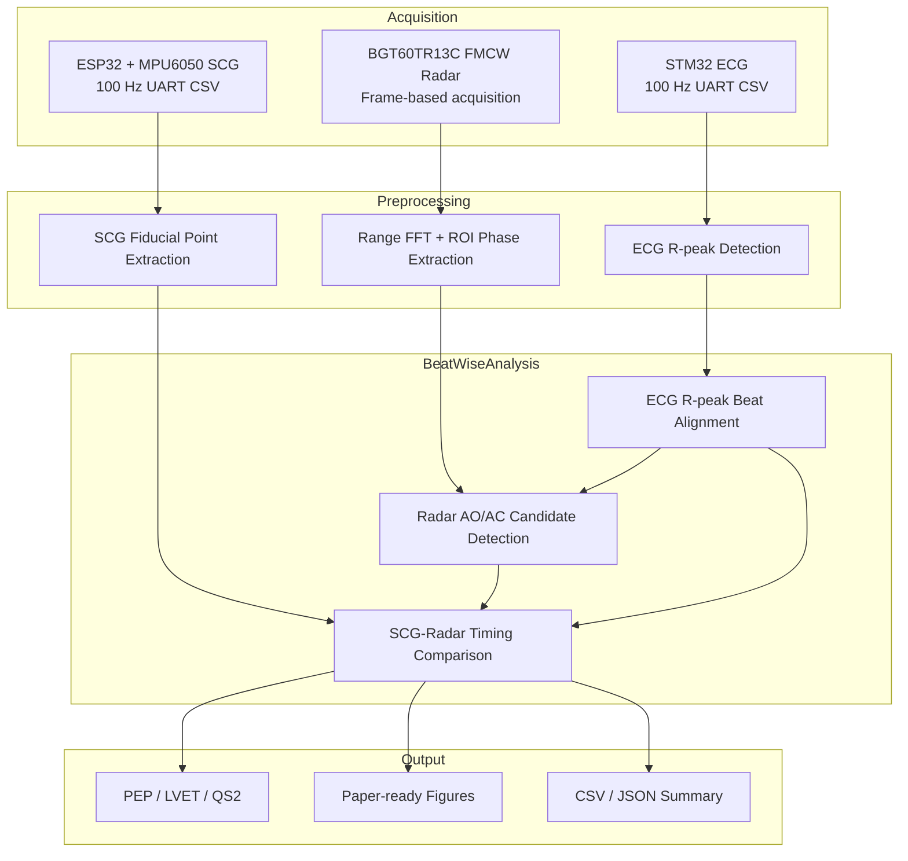
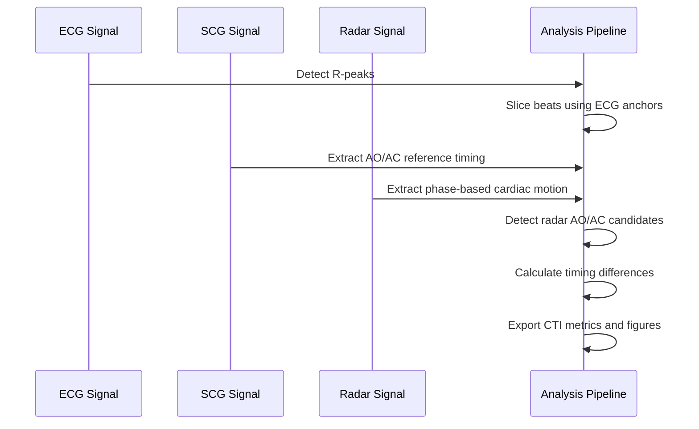

# FMCW Radar AO/AC Cardiac Timing Analysis

> Beat-wise analysis of aortic valve opening and closure candidate timing using ECG, SCG, and non-contact FMCW radar signals.

> [!IMPORTANT]
> Radar AO/AC landmarks in this repository are morphology-based candidate events and should not be interpreted as direct valve imaging results.

> [!WARNING]
> This repository is a research prototype and is not intended for medical diagnosis or clinical decision-making.

---

## Short Abstract

This project analyzes cardiac mechanical event candidates from non-contact FMCW radar signals. ECG R-peaks are used as beat alignment anchors, SCG fiducial points are used as AO/AC timing references, and radar beat morphology is evaluated to detect AO/AC candidate events. The final outputs support beat-wise timing comparison and CTI calculation.

---

## System Pipeline



---

## Signal Acquisition Overview

| Signal | Hardware | Sampling / Output | Purpose |
|---|---|---|---|
| ECG | STM32 ECG module | 100 Hz target, UART CSV | R-peak beat alignment anchor |
| SCG | ESP32 + MPU6050 | 100 Hz target, UART CSV | AO/AC reference timing generation |
| Radar | Infineon BGT60TR13C | FMCW frames | Non-contact cardiac micro-motion analysis |

---

## Firmware Overview

### STM32 ECG

- ADC input: `ADC1_IN0`, `PA0`
- UART: `USART2`, `PA2 TX`, `PA3 RX`
- Timer: TIM1 interrupt-based sampling
- Output: `sample_index,ADCValue,Smooth_ECG`

### ESP32 MPU6050 SCG

- I2C sensor: MPU6050
- SDA: GPIO21
- SCL: GPIO22
- Output: `sample_index,t_ms,ax_g,ay_g,az_g,gx_dps,gy_dps,gz_dps`

---

## AO/AC Detection Workflow



---

## Example Outputs

The analysis pipeline can export:

- Beat-wise AO/AC timing tables
- SCG-Radar relative timing differences
- CTI summary tables
- Signal quality metrics
- Paper-ready figures

Raw biosignal data is excluded from the repository by default.

---

## Limitations

- Radar AO/AC points are candidate morphology landmarks, not direct valve images.
- ECG is used for beat alignment, not AO/AC ground truth.
- Independent reference modalities such as echocardiography, ICG, or PCG are required for absolute valve-event validation.
- Current code is intended for research reproducibility support, not clinical deployment.

---

## Citation

```bibtex
@inproceedings{ryu2026fmcw_aoac,
  title={Analysis of Aortic Valve Opening and Closure Using Cardiac Signals Acquired by Non-Contact FMCW Radar},
  author={Ryu, Hyeong-Rok and Kang, Woo-Seok and Kim, Kyung-Ho},
  year={2026},
  affiliation={Dankook University}
}
```
