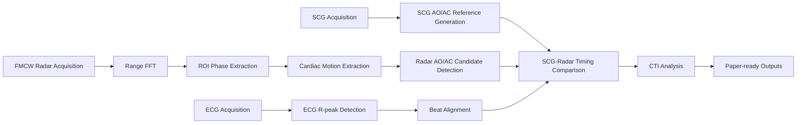
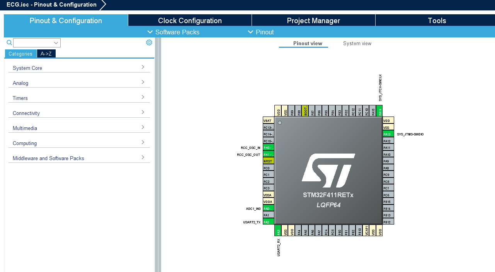

# Analysis of Aortic Valve Opening and Closure Using Cardiac Signals Acquired by Non-Contact FMCW Radar

This project organizes research prototype code for analyzing aortic valve opening and closure timing candidates from ECG-aligned SCG and non-contact FMCW radar cardiac motion signals.

> [!IMPORTANT]
> Radar AO/AC landmarks in this repository are morphology-based candidate events and should not be interpreted as direct valve imaging results.

## Short Abstract

The pipeline acquires ECG, SCG, and FMCW radar signals, aligns beats using ECG R-peaks, uses SCG fiducial points as AO/AC timing references, and compares those reference timings with morphology-based AO/AC candidates detected from radar-derived cardiac motion waveforms.

## System Pipeline



## Documentation Pages

- [STM32F411 ECG firmware configuration](stm32_f411_ecg_firmware.md)
- [Python signal processing algorithms](python_algorithms.md)

## Signal Acquisition Overview

| Signal | Hardware | Sampling/Output |
|---|---|---|
| ECG | STM32F411 ECG module | 100 Hz target UART CSV |
| SCG | ESP32 + MPU6050 | 100 Hz USB Serial CSV |
| Radar | Infineon BGT60TR13C | FMCW frame acquisition and phase displacement extraction |

## STM32F411 ECG Configuration Snapshot

| Item | Setting |
|---|---|
| MCU | STM32F411RETx, LQFP64 |
| ADC input | ADC1_IN0 on PA0 |
| UART | USART2 TX PA2, RX PA3 |
| Timer | TIM1 update interrupt |
| Timer parameters | Prescaler 9999, period 99 |
| System clock | PLLCLK, 100 MHz SYSCLK/HCLK |
| Target ECG sampling | 100 Hz |



## Firmware Overview

The STM32 firmware samples ECG-like analog input through ADC1_IN0 on PA0 and streams `sample_index,ADCValue,Smooth_ECG` over USART2 at 115200 baud.

The ESP32 firmware reads MPU6050 6-axis IMU data over I2C using GPIO21/GPIO22, performs startup bias calibration, and streams `sample_index,t_ms,ax_g,ay_g,az_g,gx_dps,gy_dps,gz_dps` at 115200 baud.

## AO/AC Detection Workflow

1. Detect ECG R-peaks for beat alignment.
2. Slice ECG, SCG, and radar signals into beat-wise windows.
3. Generate SCG AO/AC reference timings from fiducial points.
4. Extract radar cardiac motion from range FFT, ROI phase, and respiration/motion cancellation.
5. Detect radar AO/AC candidates using morphology-based detectors.
6. Fuse candidate timing and confidence information.
7. Compute SCG-radar timing differences and CTI metrics.

## Output Examples

The analysis may produce beat-wise AO/AC timing tables, CTI summaries, signal quality metrics, JSON summaries, and paper-ready figures under the configured output directory.

```text
results/
└── ex1(YYYY-MM-DD-HH.MM_60s)/
    ├── ao_ac_results_with_sqi_errors.csv
    ├── paper_export/
    └── summary JSON/figure outputs
```

Raw biosignal outputs are ignored by default and should not be committed publicly without consent and anonymization.

## Limitations

- ECG is an alignment anchor, not a direct AO/AC ground truth.
- SCG fiducial points provide reference timing for comparison.
- Radar AO/AC candidates are morphology-based events, not direct valve imaging.
- Independent reference modalities such as echocardiography, ICG, or PCG are required for absolute AO/AC validation.
- The repository is a research prototype and is not intended for clinical deployment.

## Citation

```bibtex
@inproceedings{ryu2026fmcw_aoac,
  title={Analysis of Aortic Valve Opening and Closure Using Cardiac Signals Acquired by Non-Contact FMCW Radar},
  author={Ryu, Hyeong-Rok and Kang, Woo-Seok and Kim, Kyung-Ho},
  year={2026},
  affiliation={Dankook University}
}
```
