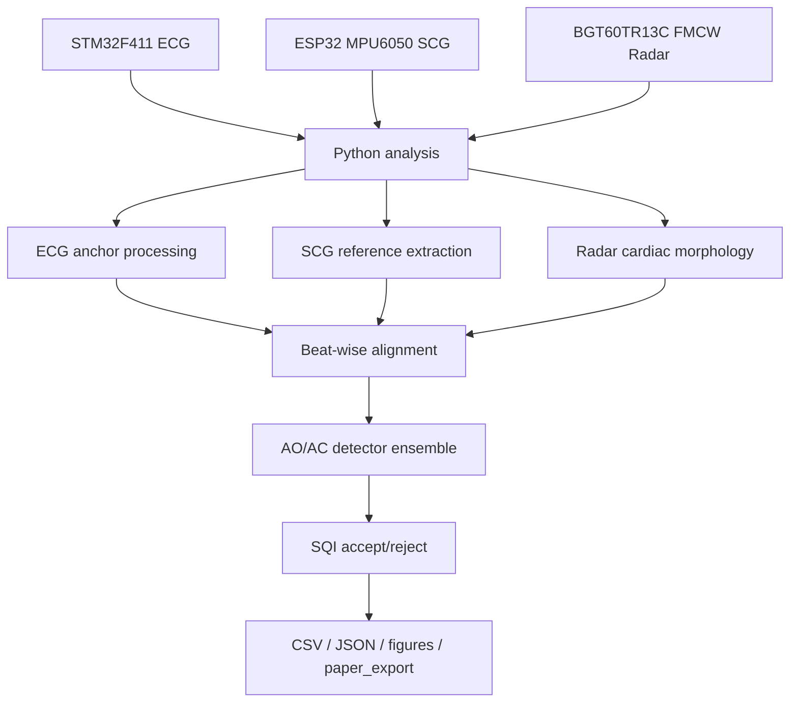
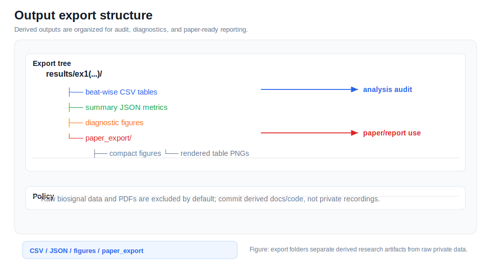

# Analysis of Aortic Valve Opening and Closure Using Cardiac Signals Acquired by Non-Contact FMCW Radar

> [!IMPORTANT]
> Radar AO/AC landmarks in this repository are morphology-based candidate events. They are not direct valve imaging and are not clinical diagnostic outputs.

## Project Summary

This GitHub Pages site documents the full research-code pipeline for ECG/SCG/FMCW radar AO/AC candidate timing analysis. It covers embedded acquisition firmware, biomedical signal preprocessing, FMCW radar micro-motion extraction, beat alignment, detector ensembles, SQI-based rejection, CTI metrics, and paper-ready export.

## Documentation Navigation

| Document | Description |
|---|---|
| [Algorithm Details](algorithm_details.md) | End-to-end algorithm narrative |
| [Signal Processing Formulas](signal_processing_formulas.md) | Equations used throughout the pipeline |
| [Detector Methods](detector_methods.md) | AO/AC detector ensemble details |
| [Filtering Methods](filtering_methods.md) | Filters and artifact suppression methods |
| [Radar Processing](radar_processing.md) | FMCW radar processing and micro-motion extraction |
| [ECG Processing](ecg_processing.md) | ECG parsing, preprocessing, R-peaks, and Q/T pseudo-landmarks |
| [SCG Processing](scg_processing.md) | MPU6050 SCG preprocessing and reference fiducials |
| [Beat Alignment and CTI](beat_alignment_and_cti.md) | Beat slicing, alignment, timing metrics, and CTI |
| [SQI and Rejection](sqi_and_rejection.md) | Signal quality metrics and beat rejection |
| [Configuration Reference](configuration_reference.md) | Runtime dataclass defaults |
| [Code Reference](code_reference.md) | Extracted class/function map |
| [Firmware Guide](firmware_guide.md) | STM32 and ESP32 firmware notes |
| [Output Reference](output_reference.md) | Result files and paper export structure |
| [References](references.md) | Literature basis and conceptual adaptation notes |


## Overall System Architecture





*Output export overview.*

## Full Pipeline Diagram


## Reference Paper List

- Zheng et al., 2024: SCG AO detection with preprocessing, SVMD, waveform factor, and seventh-power concepts.
- Di Rienzo et al., 2017: Beat-to-beat SCG cardiac mechanics, fiducial extraction, congruency checks, and CTI.
- Qiao et al., 2022: Contactless radar cardiac micro-motion model and ECG-RCG interpretation.
- Ryu et al., 2026: ECG/SCG/FMCW radar simultaneous acquisition and beat-wise radar AO/AC candidate timing comparison.

## Limitations

> [!WARNING]
> ECG is a beat anchor, SCG is a mechanical reference comparison signal, and radar AO/AC landmarks are morphology-based candidates. Absolute validation requires independent modalities such as echocardiography, ICG, or PCG.

## Citation

```bibtex
@inproceedings{ryu2026fmcw_aoac,
  title={Analysis of Aortic Valve Opening and Closure Using Cardiac Signals Acquired by Non-Contact FMCW Radar},
  author={Ryu, Hyeong-Rok and Kang, Woo-Seok and Kim, Kyung-Ho},
  year={2026},
  affiliation={Dankook University}
}
```
