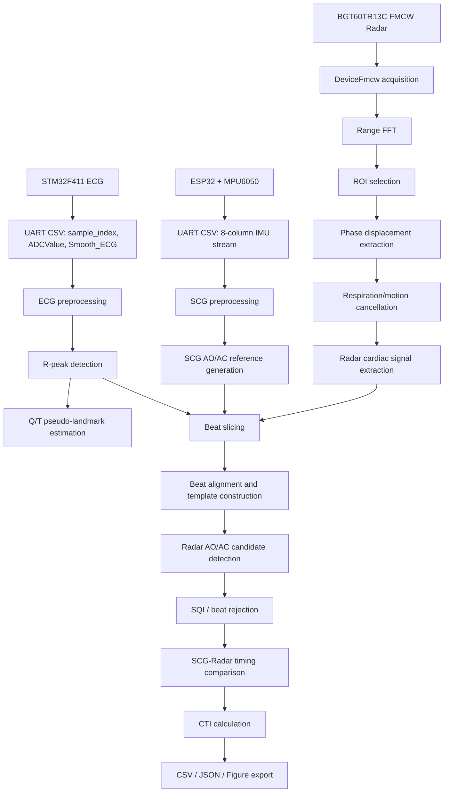
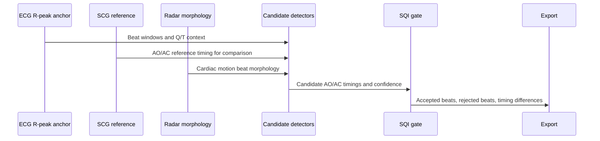

# Analysis of Aortic Valve Opening and Closure Using Cardiac Signals Acquired by Non-Contact FMCW Radar

> [!IMPORTANT]
> Radar AO/AC landmarks in this repository are morphology-based candidate events. They should not be interpreted as direct valve imaging or clinical diagnosis.

## Short Abstract

This project documents a research prototype for beat-wise AO/AC candidate timing analysis using ECG, SCG, and non-contact FMCW radar. ECG R-peaks provide beat alignment anchors, SCG fiducial points provide reference timing for comparison, and radar beat morphology provides AO/AC candidate landmarks. The pipeline exports CSV, JSON, diagnostic plots, and paper-ready figures to support reproducible research reporting.

## Documentation

- [Algorithm Details](algorithm_details.md)
- [Configuration Reference](configuration_reference.md)
- [Code Reference](code_reference.md)
- [Firmware Guide](firmware_guide.md)
- [Output Reference](output_reference.md)
- [Research Notes](research_notes.md)
- [STM32F411 ECG Firmware Configuration](stm32_f411_ecg_firmware.md)


## Key Contributions

| Area | Contribution |
|---|---|
| Multi-sensor acquisition | STM32 ECG, ESP32 MPU6050 SCG, and BGT60TR13C radar streams |
| Beat alignment | ECG R-peak anchored beat slicing and template alignment |
| Reference comparison | SCG AO/AC fiducials used as timing reference for radar comparison |
| Radar morphology | Derivative, notch, wavelet-like, template, SCG-inspired, and seventh-power AO candidate detectors |
| Quality control | Beat SQI metrics and rejection logic for contaminated morphology |
| Paper support | CSV/JSON summaries, compact paper figures, and rendered table exports |

## System Overview



## Signal Acquisition Table

| Signal | Hardware | Transport | Main Output |
|---|---|---|---|
| ECG | STM32F411RETx | USART2 115200 baud | `sample_index,ADCValue,Smooth_ECG` |
| SCG | ESP32 + MPU6050 | USB Serial 115200 baud | `sample_index,t_ms,ax_g,ay_g,az_g,gx_dps,gy_dps,gz_dps` |
| Radar | Infineon BGT60TR13C | ifxradarsdk `DeviceFmcw` | FMCW frames and phase displacement |

## Processing Pipeline



## AO/AC Detection Workflow

1. ECG R-peaks define beat-relative time.
2. SCG fiducials generate AO/AC reference timing rows.
3. Radar phase displacement is filtered into cardiac motion morphology.
4. Multiple morphology detectors produce AO/AC candidates.
5. Median/confidence fusion combines candidate evidence.
6. SQI rejects beats with unstable morphology or contamination.
7. SCG-radar timing differences and CTI values are exported.

## Limitations

> [!WARNING]
> This repository is not a medical device and is not clinical diagnosis software. ECG is a beat anchor, SCG is a reference comparison signal, and radar AO/AC landmarks are morphology-based candidate timings. Absolute validation requires independent reference modalities such as echocardiography, ICG, or PCG.

## Citation

```bibtex
@inproceedings{ryu2026fmcw_aoac,
  title={Analysis of Aortic Valve Opening and Closure Using Cardiac Signals Acquired by Non-Contact FMCW Radar},
  author={Ryu, Hyeong-Rok and Kang, Woo-Seok and Kim, Kyung-Ho},
  year={2026},
  affiliation={Dankook University}
}
```
