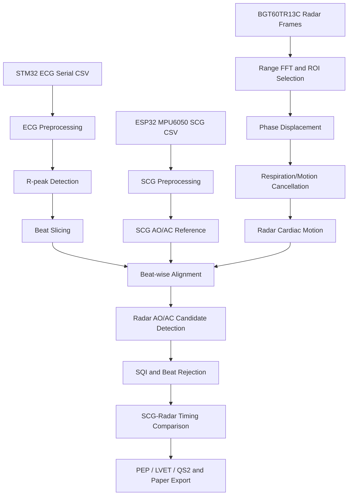

# Python Signal Processing Algorithms

This page summarizes the main processing blocks implemented in `src/ecg_scg_radar_aoac_analysis.py`. It documents the code at a method level without changing detector thresholds, timing windows, SQI definitions, or fusion logic.

## Configuration Blocks

| Config | Purpose |
|---|---|
| `ECGConfig` | STM32 serial settings, ECG filtering bands, artifact suppression, R-peak detector bounds, and CSV parsing options |
| `SCGConfig` | ESP32/MPU6050 serial settings, SCG axis/magnitude selection, filtering, and LMS respiration/motion cancellation |
| `RadarConfig` | BGT60TR13C acquisition settings, range FFT/ROI selection, phase displacement extraction, and radar cardiac filtering |
| `AnalysisConfig` | Beat slicing, AO/AC timing windows, SQI thresholds, template alignment, detector fusion, and CTI calculation settings |

## End-to-End Pipeline



## ECG Processing

The ECG path is designed to provide a beat alignment anchor, not AO/AC ground truth.

| Function or Block | Description |
|---|---|
| `parse_stm32_ecg_csv_lines` | Parses STM32 UART CSV rows, including `sample_index`, `ADCValue`, and `Smooth_ECG` style data. |
| `preprocess_stm32_ecg` | Normalizes ADC data, applies Hampel artifact suppression, notch filtering, baseline removal, optional LMS artifact cancellation, FFT-domain motion attenuation, and separate display/QRS-band outputs. |
| `robust_ecg_rpeak_detector` | Detects R-peaks using a Pan-Tompkins-like morphology score with amplitude, slope, local energy, prominence, and refractory constraints. |
| `postprocess_rpeaks_short_rr` | Removes likely double detections without changing the core detector. |
| `detect_ecg_q_t_landmarks` | Estimates Q/T pseudo-landmarks for quality/interval context; these are not treated as direct AO/AC references. |

## SCG Processing

The SCG path provides reference mechanical event timing for comparison with radar candidate events.

| Function or Block | Description |
|---|---|
| `parse_esp32_mpu6050_scg_csv_lines` | Parses 8-column MPU6050 serial output. |
| `preprocess_scg_signal` | Builds SCG-like acceleration features from MPU6050 axes, applies band-pass filtering, and optionally uses LMS cancellation for respiration/motion components. |
| `scg_reference_aoac_pipeline` | Generates beat-wise SCG AO/AC reference rows aligned to ECG R-peaks. |
| `_p21_build_scg_reference_table` | Builds a literature-guided SCG reference table used by later export/visualization patches. |
| `_p23_dirienzo_fiducials` | Implements Di Rienzo-style SCG fiducial logic for candidate mechanical landmarks. |
| `_p23_hikaf_baseline` / `_p23_hikaf_runtime_track` | Implements HIKAF-style baseline/runtime tracking for SCG reference event timing. |

## Radar Acquisition and Cardiac Motion Extraction

The radar path converts FMCW frames into a cardiac motion waveform before beat-wise AO/AC candidate detection.

| Function or Block | Description |
|---|---|
| `DeviceFmcw` acquisition path | Uses Infineon `ifxradarsdk` for BGT60TR13C FMCW frame acquisition. |
| Range FFT / ROI selection | Finds the range-bin region of interest for chest micro-motion. |
| Phase displacement extraction | Unwraps/uses radar phase changes to estimate displacement-like cardiac motion. |
| `radar_respiration_lms_pipeline` | Suppresses respiration/motion contamination using LMS-style adaptive cancellation and cardiac-band post-filtering. |
| `run_radar_only_acquisition` | Supports radar-only acquisition for later candidate-consistency inference workflows. |

## Beat Alignment and Template Handling

| Function or Block | Description |
|---|---|
| `build_initial_beats` | Slices radar beats around ECG R-peak anchors. |
| `align_beats_to_template` | Uses cross-correlation lag estimation to align beat morphology to a template. |
| `make_template_from_beats` | Builds representative templates from accepted beat segments. |
| `estimate_beat_lag_xcorr` | Estimates beat-to-template lag within a bounded lag window. |

## AO/AC Candidate Detectors

The script intentionally uses multiple morphology-based candidate detectors rather than a single peak rule.

| Detector | Main Idea |
|---|---|
| `derivative_detector` | Uses local slope extrema inside AO/AC timing windows. |
| `curvature_detector` | Scores curvature/inflection changes that can correspond to rapid mechanical transitions. |
| `local_energy_detector` | Scores short-time local energy around candidate events. |
| `notch_tidal_detector` | Looks for notch/tidal morphology, especially useful for AC-like transitions. |
| `wavelet_ridge_detector` | Uses CWT/morlet-style ridge evidence when available, with fallback behavior when CWT support is absent. |
| `template_detector` | Compares beat morphology with template timing patterns. |
| `morphology_event_detector` | Combines slope, zero-crossing, local extrema, curvature, and timing prior terms. |
| `scg_inspired_aoac_detector` | Adapts SCG fiducial detection logic to radar beat morphology. |
| `radar_event_score_detector_with_ecg_prior` | Scores radar morphology with optional ECG-derived timing prior context. |
| `zheng_seventh_power_ao_detector` | Applies a seventh-power/envelope style AO enhancement inspired by Zheng-style SCG processing. |
| `scg_paper_style_ao_ac_detector` | Implements SCG-paper-inspired AO/AC candidate logic adapted for radar PPG-like beats. |
| `ac_inflection_zero_cross_detector` | AC-specific detector emphasizing falling-slope, inflection, notch, and temporal consistency. |
| `ao_fallback_timing_prior_detector` / `ac_fallback_timing_prior_detector` | Fallback detectors used when primary morphology evidence is weak. |

## Fusion, SQI, and Beat Rejection

| Function or Block | Description |
|---|---|
| `ao_ac_pipeline` | Main beat-wise AO/AC candidate generation and fusion path. |
| `compute_beat_sqi` | Computes signal quality metrics including amplitude variation, cardiac bandpower ratio, template correlation, slope energy, and contamination proxy terms. |
| `paper_tight_event_lock` | Optional constrained refinement/audit logic used for paper export variants. |
| `compute_radar_morphology_visibility` | Quantifies whether radar morphology visibly supports candidate timing. |
| `extract_candidate_consistency_features` | Builds candidate-consistency features for model-based analysis. |
| `train_candidate_consistency_models` | Trains candidate-consistency models with Ridge, Lasso, Random Forest, and Gradient Boosting candidates when enabled. |
| `predict_radar_only_aoac` | Applies learned candidate-consistency models to radar-only beats. |

## CTI and Export

The code computes cardiac timing intervals from candidate event timings:

```text
PEP  = t_AO - t_Q
LVET = t_AC - t_AO
QS2  = t_AC - t_Q
```

| Export Function | Description |
|---|---|
| `save_all` | Saves CSV, JSON, figures, SQI metrics, and paper export outputs. |
| `summarize_aoac_timing` | Summarizes AO/AC timing distributions and related error/interval tables. |
| `export_paper_tables_and_figures` | Creates paper-ready tables and figures under `paper_export`. |
| `add_*_figure` helpers | Generate diagnostic and paper-style plots for ECG, SCG, radar, beat alignment, AO/AC timing, and CTI outputs. |

## Interpretation Limits

- ECG R-peaks are used as beat anchors only.
- SCG fiducials are used as reference timing for comparison.
- Radar AO/AC points are morphology-based candidate events.
- Absolute valve event validation requires an independent modality such as echocardiography, ICG, or PCG.
- The algorithm is a research prototype and is not clinical decision software.
