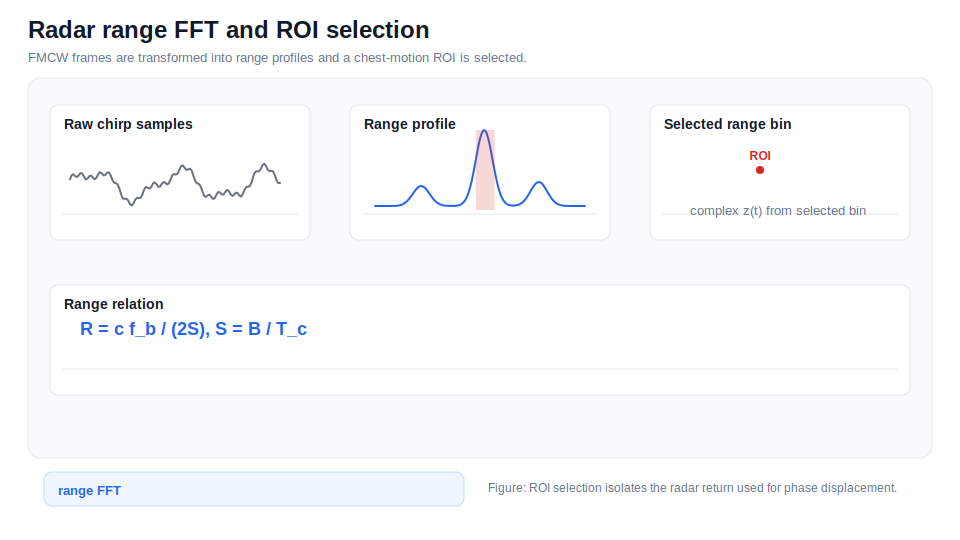
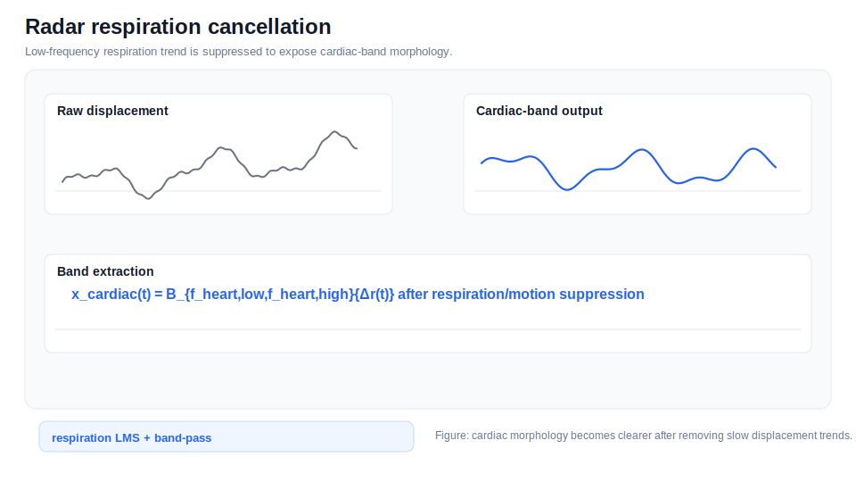

# Radar Processing

## Documentation Navigation

| Document | Description |
|---|---|
| [Algorithm Details](algorithm_details.md) | End-to-end algorithm narrative |
| [Signal Processing Formulas](signal_processing_formulas.md) | Equations used throughout the pipeline |
| [Detector Methods](detector_methods.md) | AO/AC detector ensemble details |
| [Filtering Methods](filtering_methods.md) | Filters and artifact suppression methods |
| [Radar Processing](radar_processing.md) | FMCW radar processing and micro-motion extraction |
| [ECG Processing](ecg_processing.md) | ECG parsing, preprocessing, R-peaks, and Q/T pseudo-landmarks |
| [SCG Processing](scg_processing.md) | MPU6050 SCG preprocessing and reference fiducials |
| [Beat Alignment and CTI](beat_alignment_and_cti.md) | Beat slicing, alignment, timing metrics, and CTI |
| [SQI and Rejection](sqi_and_rejection.md) | Signal quality metrics and beat rejection |
| [Configuration Reference](configuration_reference.md) | Runtime dataclass defaults |
| [Code Reference](code_reference.md) | Extracted class/function map |
| [Firmware Guide](firmware_guide.md) | STM32 and ESP32 firmware notes |
| [Output Reference](output_reference.md) | Result files and paper export structure |
| [References](references.md) | Literature basis and conceptual adaptation notes |


```mermaid
flowchart TD
    Frame[FMCW frame] --> Win[windowing / DC removal]
    Win --> FFT[range FFT]
    FFT --> ROI[range-angle ROI selection]
    ROI --> Z[complex z(t)]
    Z --> Phase[unwrap(angle z)]
    Phase --> Disp[phase-to-displacement]
    Disp --> Resp[respiration/motion cancellation]
    Resp --> Cardiac[cardiac-band radar signal]
    Cardiac --> Beat[beat-wise morphology]
```



*Radar range FFT and ROI selection example.*

`IfxRadarBackend` and `RadarCollector` use Infineon `DeviceFmcw` to acquire BGT60TR13C frames. Range FFT and ROI logic select the complex radar return used for phase processing.


*Radar phase extraction example.*

The selected complex signal is converted into unwrapped phase and displacement-like micro-motion:

$$\phi(t)=\operatorname{unwrap}(\angle z(t))$$

$$\Delta r(t)=\frac{\lambda}{4\pi}\Delta\phi(t)$$



*Radar respiration cancellation example.*

Respiration/motion cancellation and cardiac-band filtering produce the radar PPG-like cardiac morphology used by AO/AC detectors.

## FMCW Range Relation

$$R = \frac{c f_b}{2S}, \quad S = \frac{B}{T_c}$$

## Qiao-Style Micro-Motion Model

$$s(t)=d_0+d_r\sin(2\pi f_rt)+d_h\sin(2\pi f_ht)$$

This model explains why radar displacement can contain both respiratory and cardiac components. The repository extracts morphology-based candidate landmarks from the cardiac component, not direct valve images.
