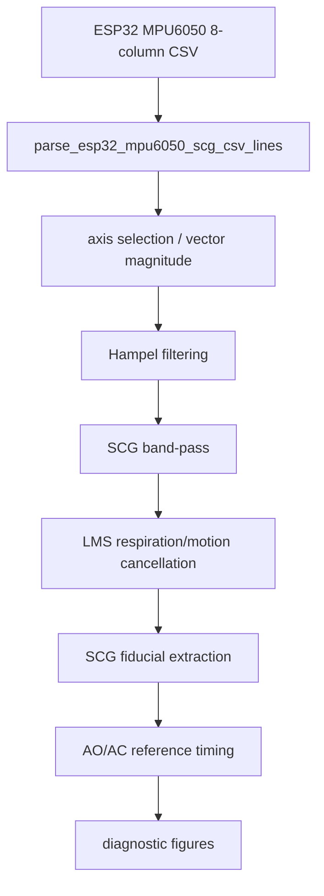
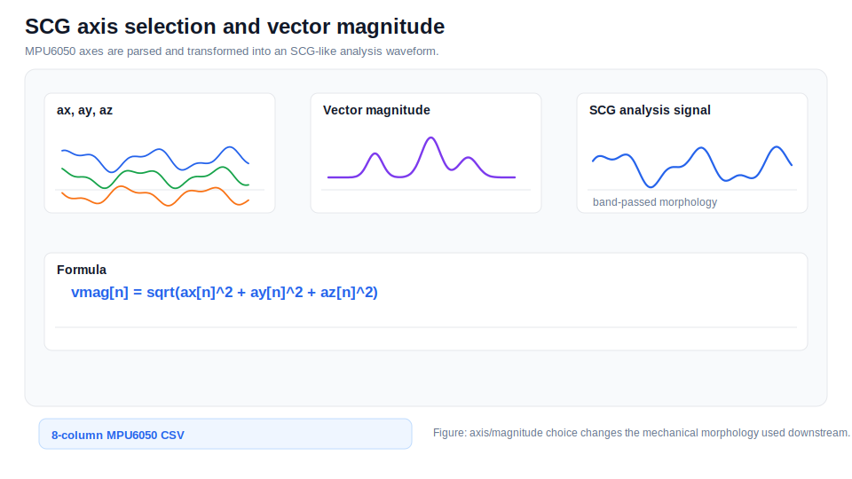

# SCG Processing

## Documentation Navigation

| Document | Description |
|---|---|
| [Algorithm Details](algorithm_details.md) | End-to-end algorithm narrative |
| [Signal Processing Formulas](signal_processing_formulas.md) | Equations used throughout the pipeline |
| [Detector Methods](detector_methods.md) | AO/AC detector ensemble details |
| [Filtering Methods](filtering_methods.md) | Filters and artifact suppression methods |
| [Radar Processing](radar_processing.md) | FMCW radar processing and micro-motion extraction |
| [ECG Processing](ecg_processing.md) | ECG parsing, preprocessing, R-peaks, and Q/T pseudo-landmarks |
| [SCG Processing](scg_processing.md) | MPU6050 SCG preprocessing and reference fiducials |
| [Beat Alignment and CTI](beat_alignment_and_cti.md) | Beat slicing, alignment, timing metrics, and CTI |
| [SQI and Rejection](sqi_and_rejection.md) | Signal quality metrics and beat rejection |
| [Configuration Reference](configuration_reference.md) | Runtime dataclass defaults |
| [Code Reference](code_reference.md) | Extracted class/function map |
| [Firmware Guide](firmware_guide.md) | STM32 and ESP32 firmware notes |
| [Output Reference](output_reference.md) | Result files and paper export structure |
| [References](references.md) | Literature basis and conceptual adaptation notes |

*SCG axis selection and vector magnitude example.*

The ESP32 firmware emits `sample_index,t_ms,ax_g,ay_g,az_g,gx_dps,gy_dps,gz_dps`. Time can be reconstructed from `t_ms` or `sample_index / SCG_FS_HINT_HZ`.

*SCG AO/AC reference example.*

SCG fiducials provide mechanical reference timing for comparison with radar candidates. The code includes Di Rienzo-style fiducial concepts, HIKAF-like tracking, and diagnostic figure generation.

*MTI-style interference cancellation example.*

Zheng-style preprocessing concepts such as MTI-like cancellation and AO emphasis are documented conceptually and adapted for repository explanation.

## Fiducial Concepts

SCG may include landmarks such as MC, AO, AC, and MO depending on signal quality and morphology. This repository emphasizes AO/AC reference timing for radar comparison.

## Limitation

SCG reference timing is not equivalent to echocardiography. It is a mechanical reference signal used for relative comparison.
