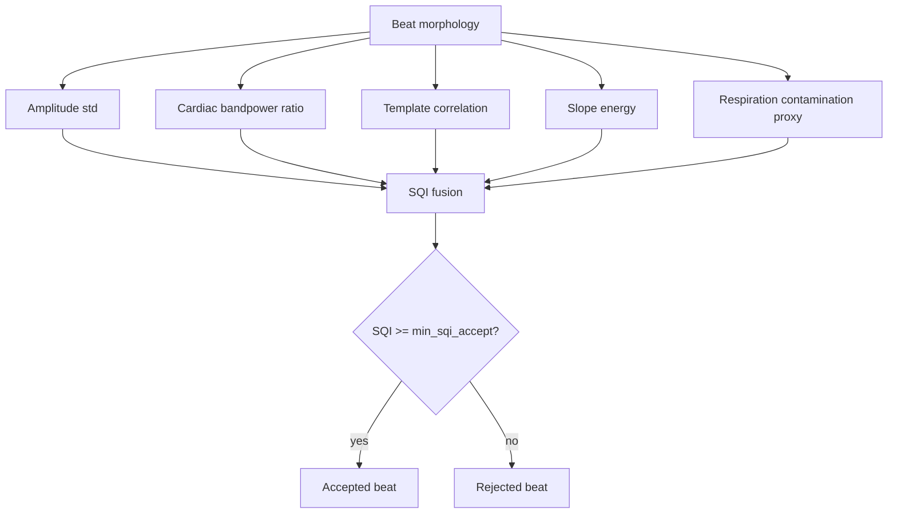

# SQI and Beat Rejection

## Documentation Navigation

| Document | Description |
|---|---|
| [Algorithm Details](algorithm_details.md) | End-to-end algorithm narrative |
| [Signal Processing Formulas](signal_processing_formulas.md) | Equations used throughout the pipeline |
| [Detector Methods](detector_methods.md) | AO/AC detector ensemble details |
| [Filtering Methods](filtering_methods.md) | Filters and artifact suppression methods |
| [Radar Processing](radar_processing.md) | FMCW radar processing and micro-motion extraction |
| [ECG Processing](ecg_processing.md) | ECG parsing, preprocessing, R-peaks, and Q/T pseudo-landmarks |
| [SCG Processing](scg_processing.md) | MPU6050 SCG preprocessing and reference fiducials |
| [Beat Alignment and CTI](beat_alignment_and_cti.md) | Beat slicing, alignment, timing metrics, and CTI |
| [SQI and Rejection](sqi_and_rejection.md) | Signal quality metrics and beat rejection |
| [Configuration Reference](configuration_reference.md) | Runtime dataclass defaults |
| [Code Reference](code_reference.md) | Extracted class/function map |
| [Firmware Guide](firmware_guide.md) | STM32 and ESP32 firmware notes |
| [Output Reference](output_reference.md) | Result files and paper export structure |
| [References](references.md) | Literature basis and conceptual adaptation notes |

*SQI accept/reject example.*

## Code-Level SQI

`compute_beat_sqi` computes `amp_std`, `cardiac_ratio`, `resp_ratio`, `slope_energy`, and `template_corr`. It normalizes amplitude, cardiac power, template correlation, and slope energy, averages them with equal 0.25 weights, and applies a respiration penalty.

$$SQI_i=(0.25q_{amp}+0.25q_{card}+0.25q_{temp}+0.25q_{slope})(1-0.35q_{resp})$$

## Feature Equations

$$\rho_i = \frac{\sum_n (b_i[n]-\bar{b_i})(T[n]-\bar{T})}{\sqrt{\sum_n(b_i[n]-\bar{b_i})^2}\sqrt{\sum_n(T[n]-\bar{T})^2}}$$

$$r_{cardiac}=\frac{P(f\in[f_{c1},f_{c2}])}{P(f\in[f_{all1},f_{all2}])+\epsilon}$$

$$r_{resp}=\frac{P(f\in[f_{r1},f_{r2}])}{P(f\in[f_{c1},f_{c2}])+\epsilon}$$

## Why Rejection Is Critical

Non-contact radar morphology can be degraded by respiration, posture, weak reflection, or transient motion. Beat rejection prevents unstable morphology from dominating AO/AC summary metrics.
