# STM32F411 ECG Firmware Configuration

This page documents the STM32CubeIDE/CubeMX configuration used for the ECG acquisition firmware included in this repository.

## Board and MCU

| Item | Setting |
|---|---|
| MCU | STM32F411RETx |
| Package | LQFP64 |
| Board family | STM32F411 / STM32F4 |
| Project path | `firmware/stm32_ecg/ECG_project/` |
| CubeMX file | `firmware/stm32_ecg/ECG_project/ECG.ioc` |


## Pin Assignment

| Function | STM32 Pin | CubeMX Signal |
|---|---|---|
| ECG analog input | PA0 | ADC1_IN0 |
| UART transmit | PA2 | USART2_TX |
| UART receive | PA3 | USART2_RX |
| HSE oscillator input | PH0 | RCC_OSC_IN |
| HSE oscillator output | PH1 | RCC_OSC_OUT |
| SWD debug | PA13 / PA14 | SYS_JTMS-SWDIO / SYS_JTCK-SWCLK |

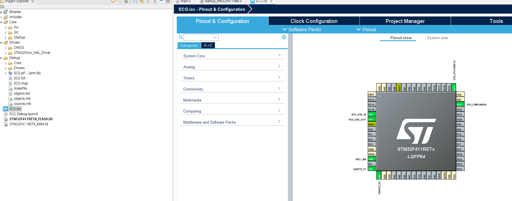

## Clock Configuration

The firmware project uses the PLL as the system clock source.

| Clock Item | Setting |
|---|---|
| HSE input | 25 MHz |
| HSE mode | Bypass Clock Source |
| PLLM | 8 |
| PLLN | 100 |
| PLLP | 2 |
| PLLQ | 4 |
| SYSCLK | 100 MHz |
| HCLK | 100 MHz |
| APB1 prescaler | /2 |
| APB1 peripheral clock | 50 MHz |
| APB1 timer clock | 100 MHz |
| APB2 prescaler | /1 |
| APB2 peripheral clock | 100 MHz |
| APB2 timer clock | 100 MHz |

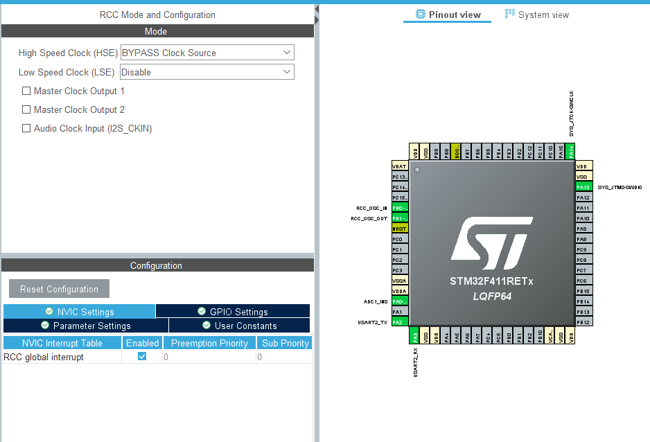

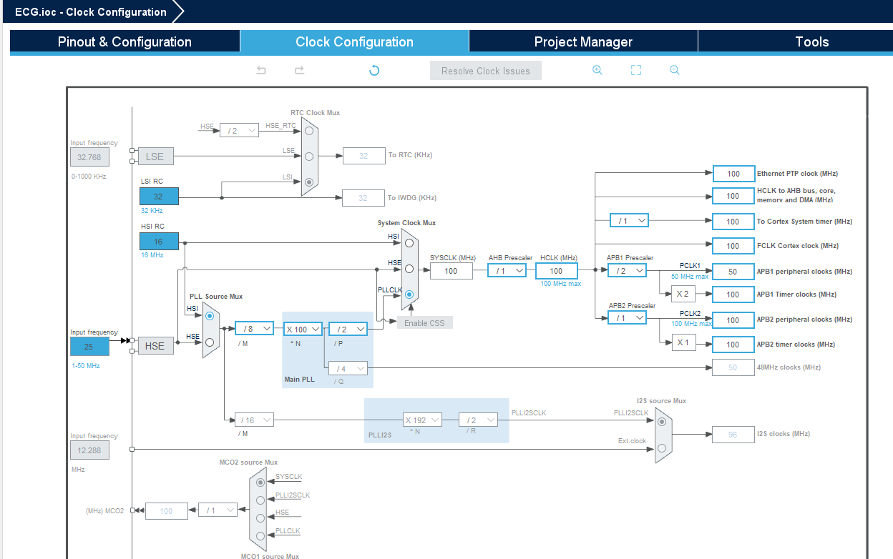

## ADC1 Configuration

ADC1 is configured for single-channel ECG analog acquisition.

| ADC Item | Setting |
|---|---|
| ADC instance | ADC1 |
| Channel | IN0 |
| Pin | PA0 |
| Resolution | 12-bit |
| Data alignment | Right alignment |
| Scan conversion | Disabled |
| Continuous conversion | Disabled |
| Number of conversions | 1 |
| Regular rank | 1 |
| Sampling time in `.ioc` | `ADC_SAMPLETIME_56CYCLES` |

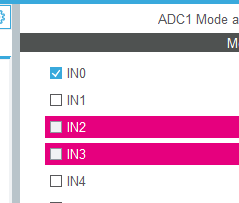

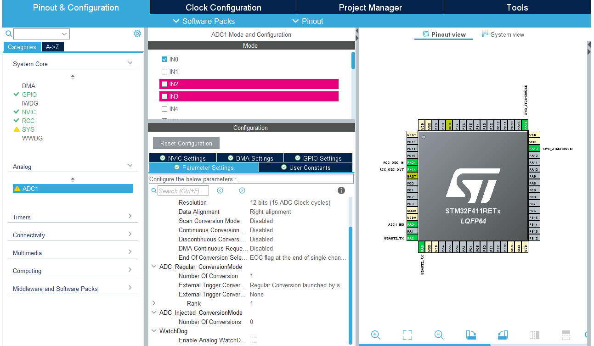

## TIM1 Sampling Timer

TIM1 is used as the sampling time base for the ECG stream.

| TIM1 Item | Setting |
|---|---|
| Clock source | Internal clock |
| Prescaler | 9999 |
| Counter mode | Up |
| Counter period | 99 |
| Repetition counter | 0 |
| Auto-reload preload | Disabled |
| Target sampling rate | 100 Hz |

With the 100 MHz APB2 timer clock, the timer update rate is:

```text
100,000,000 / (9999 + 1) / (99 + 1) = 100 Hz
```

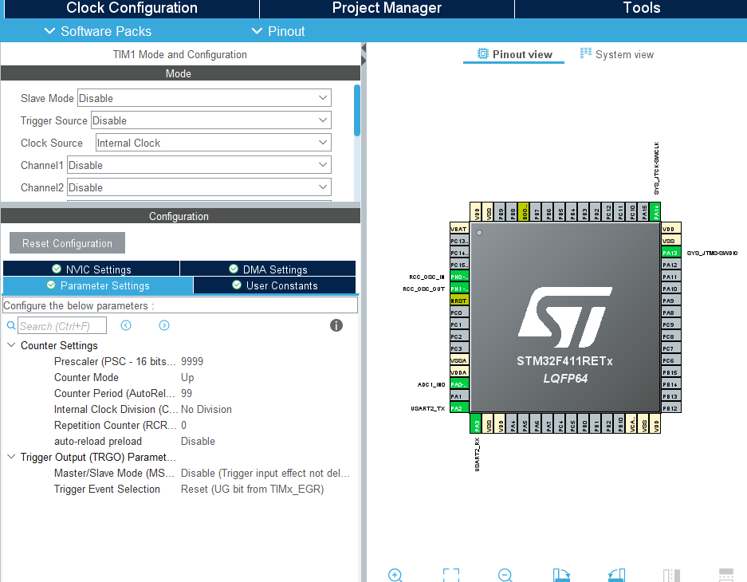

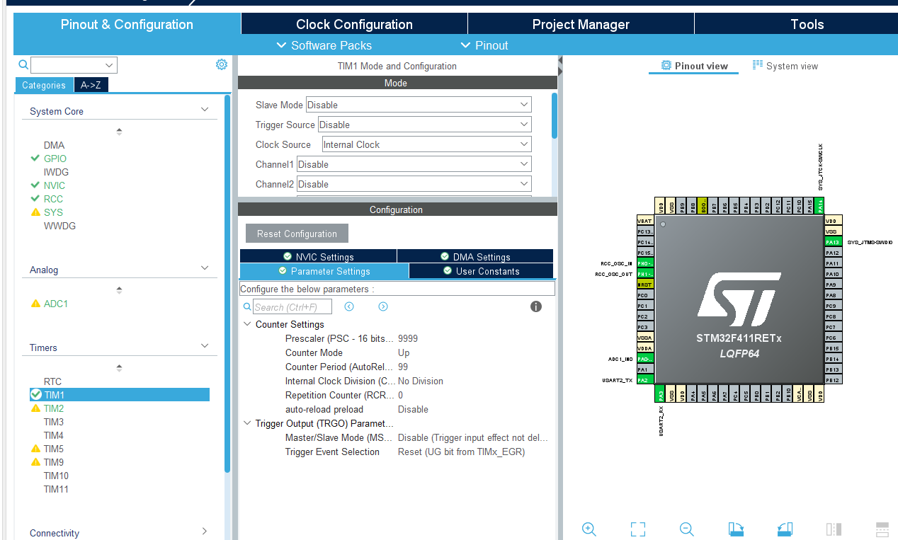

## USART2 Configuration

USART2 streams the ECG CSV data to the host PC.

| USART2 Item | Setting |
|---|---|
| Mode | Asynchronous |
| TX | PA2 |
| RX | PA3 |
| Hardware flow control | Disabled |
| Baudrate | 115200 |
| Output format | `sample_index,ADCValue,Smooth_ECG` |

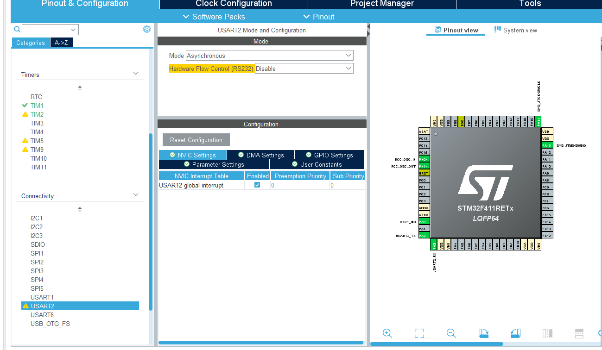

## NVIC Configuration

The CubeMX project enables interrupts needed for timed acquisition and UART streaming.

| Interrupt | Status |
|---|---|
| RCC global interrupt | Enabled |
| TIM1 update and TIM10 global interrupt | Enabled |
| TIM2 global interrupt | Enabled in project |
| USART2 global interrupt | Enabled |
| SysTick | Enabled |

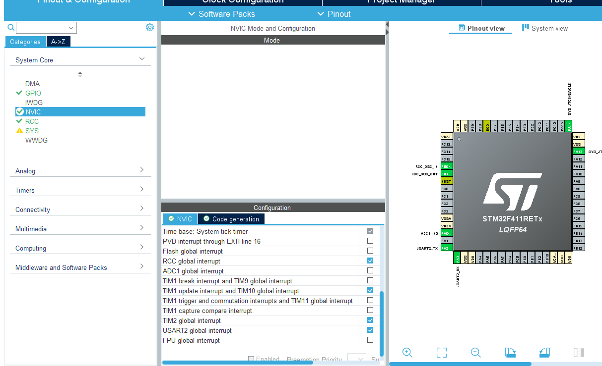

## Included Driver Tree

The STM32CubeIDE project includes CMSIS and STM32F4 HAL driver files. Their original license files are preserved inside the project tree.

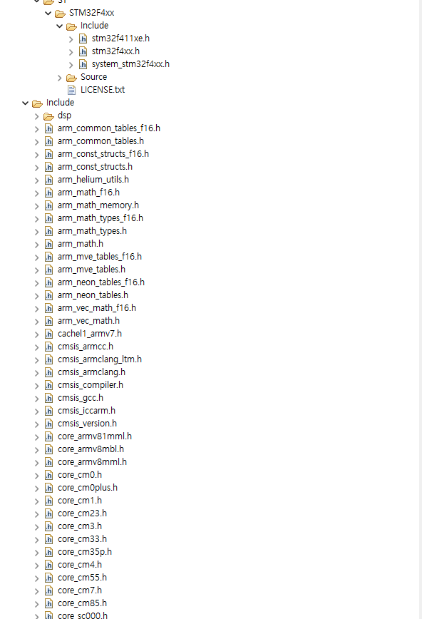

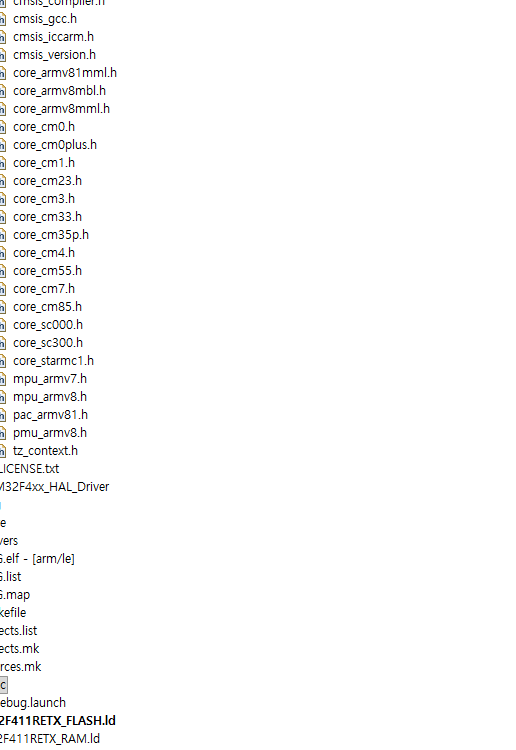

## Firmware Output

The STM32 firmware streams one ECG sample row per sample:

```csv
sample_index,ADCValue,Smooth_ECG
0,1870,1860
1,1872,1861
```

`Smooth_ECG` is generated using a 5-sample moving average in the firmware. The Python script can use this serial stream for ECG acquisition and R-peak anchored beat alignment.
